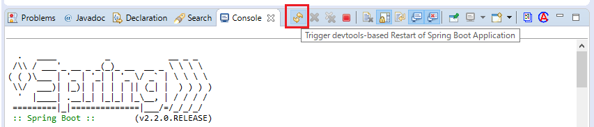

include::_include_all.adoc[]

:sectnums: 4
:toclevels: 6

[[Ch05_DeveloperTools]]
= {dt}

[[Ch05_DeveloperTools_Overview]]
== 機能説明
{dt}は{sb}での開発効率を向上させるのに有効なツールセットである。 +
下記5つの機能が提供されている。

* プロパティの開発向けチューニング
* 自動リスタート
* ブラウザの自動再読み込み(LiveReload)
* グローバル設定
* リモートアプリケーションへの対応(デバッグ用)

{GL}では各機能について、概要のみ説明する。詳細はlink:{reference_url}#using-boot-devtools[公式リファレンス]を参照すること。

=== {starter_to_use}
``spring-boot-devtools``を依存関係に追加することで有効になる。 +

[NOTE]
{si}で「{sb} DevTools」を指定した場合、dependencyのoptionalが``true``になる。 +
これは他のモジュールで{dt}が有効になるのを防ぐためである。

=== {enable_auto_configuration}
[[Ch05_DeveloperTools_Enable_AutoConfiguration_Table]]
``spring-boot-devtools``を依存関係に追加した場合に有効になる{ac}を下記に示す。

[cols="30,70", options="header"]
.{enable_auto_configuration}
|===
|クラス名
|概要

|``org.springframework.boot.devtools.`` +
``autoconfigure.DevToolsProperties``
|自動リスタートとブラウザの自動再読み込み機能および、リモートアプリケーション用のプロパティクラス。 +
「``spring.devtools.*``」のプロパティを読み込む。 +
プロパティの一覧はlink:{reference_url}#devtools-properties[公式リファレンス]を参照すること。

|``org.springframework.boot.devtools.`` +
``autoconfigure.LocalDevToolsAutoConfiguration``
|自動リスタートとブラウザ自動再読み込み(LiveReload)用の設定クラスオブジェクトを生成しBean定義を行う。 +
HandlerMapperやDispatcherFilteなどのオブジェクトが登録される。

|``org.springframework.boot.devtools.`` +
``autoconfigure.RemoteDevToolsAutoConfiguration``
|リモートアプリケーション用の設定クラスオブジェクトを生成しBean定義を行う。

|``org.springframework.boot.devtools.`` +
``autoconfigure.RemoteDevtoolsSecurityConfiguration``
|リモートアプリケーション用の{sse}設定クラスオブジェクトを生成しBean定義を行う。 +

|``org.springframework.boot.devtools.`` +
``autoconfigure.DevToolsDataSourceAutoConfiguration``
|DevTools用のDataSource設定クラスオブジェクトを生成しBean定義を行う。 +
Spring JDBCを使用しない場合は{ac}は無効になる。
|===

=== プロパティの開発向けチューニング
{dt}は開発時において有効な設定値をチューニングする。 +
詳細はlink:{github_url}spring-boot-project/spring-boot-devtools/src/main/java/org/springframework/boot/devtools/env/DevToolsPropertyDefaultsPostProcessor.java[DevToolsPropertyDefaultsPostProcessor.java]を参照すること。

[cols="30,20,50",options="header"]
.{dt}によって適用される主なプロパティ一覧
|===
|キー名
|設定値
|概要

|``spring.thymeleaf.cache``
|false
|テンプレートファイルのキャッシュを無効にする。

|``server.error.include-stacktrace``
|ALWAYS
|{sm}のエラーレスポンスにスタックトレースが含まれるようになる。
|===

[IMPORTANT]
{dt}が適用するプロパティの値を使用しない場合はspring.devtools.add-properties=falseを定義する必要がある。

=== 自動リスタート
クラスパス上のファイルが更新された場合にサーバを自動的にリスタートする機能が提供されている。 +
{sb}は自動リスタート用に2つのクラスローダを使用している。 +
具体的には、頻繁に更新されるクラスと、サードパーティJarのように更新されないクラスで使用するクラスローダを分けている。 +
アプリケーション再起動時には頻繁に更新されるクラス用のクラスローダのみを再作成することで通常よりも高速に再起動するようになっている。 +

ただし、下記パスのファイルおよび、下記名称のファイルは変更監視の対象外になっている。 +

* ``/META-INF/maven``
* ``/META-INF/resources``
* ``/resources``
* ``/static``
* ``/public``
* ``/templates``
* ``*/Test.class``
* ``*/Tests.class``
* ``git.properties``
* ``META-INF/build-info.properties``

監視対象外を変更するには{sbcf}で``spring.devtools.restart.exclude``を定義してパスを指定する。

==== トリガーファイルの利用
``spring.devtools.restart.trigger-file``プロパティを使用すると、指定したトリガーファイルを更新した場合のみリスタートが実行されるようになる。 +
ただし、クラスパス上のファイルに変更がない場合は、トリガーファイルを更新してもリスタートされない。 +
また、Spring Tool SiteやIntelliJ IDEAなどのIDEから{dt}によるリスタート機能を使用するためには指定するトリガーファイル名を.reloadtriggerにする必要がある。(ファイルは存在しなくてよい)

.IDE(Spring Tool Silte)から{dt}によるリスタートを実行するボタン

=== ブラウザの自動再読み込み
クラスパス上のファイルが更新された場合にブラウザを自動で再読み込みするLiveReloadという機能が提供されている。 +
使用する場合はlink:http://livereload.com/extensions/[livereload.com]からプラグインをダウンロードしてブラウザにインストールする必要がある。 +
詳細はlink:https://github.com/livereload/livereload-js[LiveReload.js]を参照すること。

[[Ch05_DeveloperTools_Global_Setting]]
=== グローバル設定
1つのマシン内に{dt}を使用しているアプリケーションが複数存在する場合に設定を共有することができる。 +
``spring-boot-devtools.properties``を``$HOME/.config/spring-boot``に配置することで有効になる。 +

=== リモートアプリケーションへの対応
リモート実行しているアプリケーションでも自動リスタート機能を使用できる。 +
有効にするためには、再パッケージの設定でspring-boot-maven-pluginの``excludeDevtools``属性を``false``に指定する必要がある。 +

[source,xml]
.pom.xml
----
<build>
    <plugins>
        <plugin>
            <groupId>org.springframework.boot</groupId>
            <artifactId>spring-boot-maven-plugin</artifactId>
            <configuration>
                <excludeDevtools>false</excludeDevtools>
            </configuration>
        </plugin>
    </plugins>
</build>
----

{dt}によるリモートアプリケーションへのサポートは、リソース更新の通知と変更されたリソースのプッシュ(送信)をするクライアントアプリケーションと、それらを受信するエンドポイントをもつリモートアプリケーションで構成されている。 +
そのため、通常のリビルド・デプロイの手順より効率的に開発できるようになっている。

クライアントアプリケーションを起動するにはIDEからJava Applicationとして``RemoteSpringApplication``を実行する。 +
その場合、引数としてリモートアプリケーションのURLを指定する。 +

リモートアプリケーション側のエンドポイントを有効にするには、デプロイするアプリケーションの{sbcf}に``spring.devtools.remote.secret``を定義する必要がある。

[IMPORTANT]
リモートアプリケーションへの対応はセキュリティリスクが生じるため、本番環境での使用は非推奨とする。
