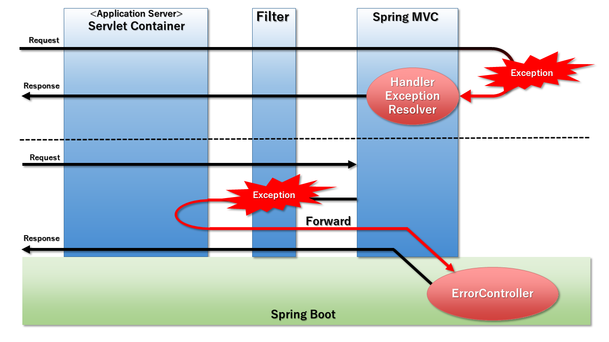

include::_include_all.adoc[]

[[ErrorHandling]]

:sectnums: 4

= 例外ハンドリング

[[ErrorHandling_Overview]]
== {overview}
{GL}では、{SB}配下の処理で発生する例外ハンドリングの機能概要について説明する。 +
内容は下記のとおりである。 +

{SB}を使用したアプリケーションでは、{SM}で設定される``org.springframework.web.servlet.HandlerExceptionResolver``による例外ハンドリングに加え、``org.springframework.boot.web.servlet.error.ErrorController``による例外ハンドリングの機能が追加される。 +

{SB}における例外ハンドリング方法を下記に示す。

[[ErrorHandling_PatternTable]]

[cols="20,30,50", options="header"]
.例外ハンドリングの機能
|===
|機能
|対応するクラス
|説明

|Controller単位でハンドリング
|``org.springframework.web.servlet.`` +
``HandlerExceptionResolver``
|ErrorControllerによるハンドリングよりも狭いスコープでより柔軟にハンドリングを行いたい場合に利用することを推奨する。 +
詳細は、<<ErrorHandling_Details_ExceptionResolver>>を参照すること。

|アプリケーション全体のハンドリング
|``org.springframework.boot.web.`` +
``servlet.error.ErrorController``
|{SB}アプリケーションにおける例外ハンドリングは、基本的にこちらで行うことを推奨する。 +
詳細は、<<ErrorHandling_Details_ErrorController>>を参照すること。
|===

[NOTE]
例外ハンドリングの機能は他にも存在するが、{GL}では取り扱わない。

[[ErrorHandling_Details]]
=== 機能詳細

[[ErrorHandling_Details_ExceptionResolver]]
==== Controller単位の例外ハンドリング
Controller単位で例外ハンドリングを行いたい場合は、HandlerExceptionResolverを用いてハンドリングを記述する。 +
 +
{SB}における本機能は、従来の{SM}で用意されていたものと同じである。 +
ハンドリングできる対象はControllerで発生したものであるため、FilterなどControllerに到達する前に発生した例外はハンドリングできない。 +
 +
HandlerExceptionResolverは、例外発生時に{DS}から呼び出されることでハンドリングを行う。 +
{SB}にデフォルトで用意されているHandlerExceptionResolverは<<SpringMVC.adoc#SpringMVC,SpringMVC>>を参照すること。 +

HandlerExceptionResolverの代表例として、``org.springframework.web.servlet.mvc.method.annotation.ExceptionHandlerExceptionResolver``を紹介する。 +
ExceptionHandlerExceptionResolverは、伝搬してきた例外の処理を``@ExceptionHandler``が付与されているメソッドに委譲する。 +
ハンドリング内容に関しては、Controllerクラスの仕様に基づき開発者が任意にカスタマイズできる。

[[ErrorHandling_Details_ErrorController]]
==== アプリケーション全体の例外ハンドリング
アプリケーション全体の例外ハンドリングを行いたい場合は、ErrorControllerを用いてハンドリングを記述する。 +
 +
{SB}のアプリケーションでは、発生した例外はすべて``/error``のURIへフォワードされる。 +
デフォルトの設定では、``/error``にマッピングされているのはErrorControllerクラスを実装した``org.springframework.boot.autoconfigure.web.servlet.error.BasicErrorController``であり、フォワードされたリクエストがもつ情報を元にハンドリングを行う。 +
 +
BasicErrorControllerでは、リクエストのAcceptヘッダなどに設定されたMedia-TypeがHTMLの場合、デフォルトのWhiteLabelErrorPageもしくは{HSC}によってViewをコントロールできる。 +
Thyemeleafを使用している場合、{HSC}によって返却するViewをコントロールする際は、<<Thymeleaf#, Thymeleaf>>の節で説明したリソースフォルダに``/error``ディレクトリを作成し、その中に``ステータスコード.html``ファイルを配置することで対応したViewを返す。 +
 +
上記以外のMedia-Typeが設定されている時はJSONを返却する。 +
返却する内容に関しては、``org.springframework.boot.web.servlet.error.ErrorAttributes``インターフェースの実装クラスによって規定されており、デフォルトでは``org.springframework.boot.web.servlet.error.DefaultErrorAttributes``クラスが使用されている。 +
返却する内容やハンドリング方法のカスタマイズに関しては、<<ErrorHandling_HowToUse_ErrorController_CustomizePoint,ErrorControllerの{customization_points}>>を参照すること。

[[ErrorHandling_HowToUse]]
== {how_to_use}

[[ErrorHandling_HowToUse_Starter]]
=== {starter_to_use}
{SB}の例外ハンドリングを有効にするために下記に示すStarterをpom.xmlに追加する。

 - {SBSW}

[[ErrorHandling_HowToUse_AutoConfiguration]]
=== {enable_auto_configuration}
{SBSW}のStarterで有効になる{AC}の中で、例外ハンドリングの機能に重要なものを下記に示す。

[[ErrorHandling_AutoConfiguration_Table]]
[cols="20,80",options="header"]
.{enable_auto_configuration}
|===
|クラス名
|概要

|``org.springframework.boot.autoconfigure.`` +
``web.servlet.ServletWebServerFactoryAutoConfiguration``
|サーブレットコンテナの設定を行う。

|``org.springframework.boot.autoconfigure.`` +
``web.servlet.WebMvcAutoConfiguration``
|MVCレイヤの設定を行う。

|``org.springframework.boot.autoconfigure.`` +
``web.servlet.error.ErrorMvcAutoConfiguration``
|ErrorControllerの設定を行う。

|``org.springframework.boot.autoconfigure.`` +
``web.ErrorProperties``
|``server.error.*``プロパティの設定値を保持する。

|===

[[ErrorHandling_HowToUse_HandlerExceptionResolver]]
=== HandlerExceptionResolverの{how_to_use}
本項では、HandlerExceptionResolverを利用した例外ハンドリングの実装方法、カスタマイズポイントを紹介する。

[[ErrorHandling_HowToUse_HandlerExceptionResolver_Implementation]]
==== HandlerExceptionResolverの{functional_how_to_use}

HandlerExceptionResolverは{SB}がデフォルトで複数種類の実装を用意しているが、本節ではExceptionHandlerExceptionResolverで
``java.lang.RuntimeException``をハンドリングし、特定のViewをユーザーに返す例を示す。

[source,java]
.RuntimeExceptionHandler.java
----

@ControllerAdvice // (1)
public class RuntimeExceptionHandler {

    @ExceptionHandler(RuntimeException.class) // (2)
    public ModelAndView handleRuntimeException(RuntimeException exception) {
        ModelAndView mv = new ModelAndView();
        mv.setStatus(HttpStatus.BAD_REQUEST); // (3)
        mv.setViewName("xxx");　// (4)
        return mv;
    }
}

----

[cols="10,90",options="header"]
|===
|項番
|概要

|(1)
|``@Controller``の場合は、付与したController配下のハンドリングしかできないが、``@ControllerAdvice``だとControllerを横断的にハンドリングできる。

|(2)
|``@ExceptionHandler``でハンドリングする例外クラスを指定する。

|(3)
|ResponseStatusはハンドリングメソッドに``@ResponseStatus``を付与することでも制御可能である。

|(4)
|任意のView名を指定する。
|===

上記クラスをBean定義することで、Controller配下でRuntimeExceptionがスローされた場合にhandleRuntimeExceptionメソッドでハンドリングされる。

[[ErrorHandling_HowToUse_HandlerExceptionResolver_CustomizePoint]]
==== HandlerExceptionResolverの{customization_points}

[[ErrorHandling_HowToUse_HandlerExceptionResolver_CustomizePoint_Property]]
===== プロパティによるカスタマイズ
代表的なプロパティを下記に示す。

[[ErrorHandling_ExceptionHandler_Property_Table]]
[cols="30,20,50", options="header"]
.代表的なプロパティ
|===
|プロパティ名
|デフォルト値
|概要

|spring.mvc.log-resolved-exception
|false
|@ExceptionHandlerによる例外ハンドリング時にログ出力を行うか。

|===

[[ErrorHandling_HowToUse_ErrorController]]
=== ErrorControllerの{how_to_use}
本項では、ErrorControllerを利用した例外ハンドリングのデフォルトでのレスポンス内容やカスタマイズポイントを紹介する。

[[ErrorHandling_HowToUse_ErrorController_Default]]
==== デフォルトで返却される内容
ErrorControllerでは、<<ErrorHandling_Details_ErrorController,機能詳細のErrorController>>で説明したように、Viewが返却される場合とJSONが返却される場合があるが、デフォルトで返却される内容に若干差異がある。 +
返却内容を下記に示す。

[cols="10,5,5,80", options="header"]
.返却内容
|===
|キー
|View
|JSON
|概要

|timestamp
|〇
|〇
|レスポンスが組み立てられた時間

|status
|〇
|〇
|{HSC}

|error
|〇
|〇
|HTTPステータスのReasonPhrase

|message
|〇
|〇
|例外メッセージ

|path
|×
|〇
|リクエストしたURI

|===

[NOTE]
入力チェックでエラーになった場合は、エラーになったチェックの情報が加わる。

[NOTE]
White Label ErrorPageが返却される場合は、上記に加えWhite Label ErrorPageが返却されたという旨の固定の文字列も返される。

[[ErrorHandling_HowToUse_ErrorController_CustomizePoint]]
==== ErrorControllerの{customization_points}

[[ErrorHandling_HowToUse_ErrorController_CustomizePoint_Property]]
===== プロパティによるカスタマイズ
代表的なプロパティを下記に示す。

[[ErrorHandling_ErrorController_Property_Table]]
[cols="30,20,50a", options="header"]
.代表的なプロパティ
|===
|プロパティ名
|デフォルト値
|概要

|server.error.path
|/error
|ErrorControllerにフォワードされる際のパス。

|server.error.whitelabel.enabled
|true
|例外発生時にデフォルトで表示されるエラーページを有効にするか。

|server.error.include-stacktrace
|never
|デフォルトで返却されるJSONレスポンスでスタックトレースを含めるか。以下の値を設定できる。 +

* always : 出力する
* never : 出力しない

on-trace-param : クエリパラメータで?trace=trueの形でリクエストごとに設定が可能になる。 +

|server.error.include-exception
|false
|デフォルトで返却されるJSONレスポンスで例外クラス名の情報を含めるか。

|===

[[ErrorHandling_HowToUse_ErrorController_CustomizePoint_JavaConfig]]
===== Bean定義によるカスタマイズ
BasicErrorControllerのレスポンスをコントロールしたい場合は、ErrorAttributesの実装クラスを
Bean定義することでカスタマイズできる。 +
カスタマイズ例は、<<ErrorHandling_HowToUse_ErrorController_CustomizePoint_Example_ErrorAttributes,ErrorAttributes実装クラスによるカスタマイズ>>を参照すること。
 +
 +
レスポンスの内容だけでなく、よりカスタマイズしたい場合は、
ErrorControllerの実装クラスをBean定義することで、既存のBasicErrorControllerを上書きできる。 +
カスタマイズ例は、<<ErrorHandling_HowToUse_ErrorController_CustomizePoint_Example_ErrorController,ErrorController実装クラスによるカスタマイズ>>を参照すること。 +

[[ErrorHandling_HowToUse_ErrorController_CustomizePoint_Example]]
==== ErrorControllerの{customization_example}

[[ErrorHandling_HowToUse_ErrorController_CustomizePoint_Example_ErrorAttributes]]
===== ErrorAttributes実装クラスによるカスタマイズ
本項では、ErrorAttributesを実装したクラスをBean定義することで、ErrorControllerによるレスポンスをカスタマイズできることを示す。 +
レスポンスとして、タイムスタンプと固定のメッセージを返却するようにカスタマイズする。

[source,java]
.CustomErrorAttributes.java
----

public class CustomeErrorAttributes extends DefaultErrorAttributes /* (1) */{

    @Override
    public Map<String, Object> getErrorAttributes(WebRequest webRequest, boolean includeStackTrace) /* (2) */{
        Map<String, Object> errorAttributes = new LinkedHashMap<>();
        errorAttributes.put("timestamp", new Date());
        errorAttributes.put("message", "error occured");
        return errorAttributes; // (3)
    }
}
----

[cols="10,90",options="header"]
|===
|項番
|概要

|(1)
|直接ErrorAttibutesを実装することも可能だが、想定する実装によって適宜選択する。

|(2)
|ErrorControllerがレスポンス作成時に呼ばれるメソッドをオーバーライドすることで、出力を制御できる。

|(3)
|最終的にこのオブジェクトがJSONもしくはWhiteLabelErrorPageにマッピングされてレスポンスになる。
|===

上記クラスはコンフィギュレーションクラスを経由しBean定義することで、例外発生時のレスポンスにタイムスタンプと固定メッセージしか返却されないことが確認できる。

[[ErrorHandling_HowToUse_ErrorController_CustomizePoint_Example_ErrorController]]
===== ErrorController実装クラスによるカスタマイズ

次に、ErrorControllerの実装クラスをBean定義し、常に指定したViewを返却させるカスタマイズ例を示す。

[source,java]
.CutomeErrorController.java
----
@Controller
@RequestMapping("${server.error.path:${error.path:/error}}")
public class CustomErrorController implements ErrorController /*(1)*/{

    @RequestMapping(produces = MediaType.TEXT_HTML_VALUE)
    public ModelAndView errorHtml(HttpServletRequest request, HttpServletResponse response) /*(2)*/{
        return new ModelAndView("custom-error.html");
    }

    @Override
    public String getErrorPath() /*(3)*/{
        return "/error";
    }

}

----
[cols="10,90",options="header"]
|===
|項番
|概要

|(1)
|ErrorControllerを実装する。

|(2)
|リクエストでHTMLが要求された際に例外が発生した際に対応するメソッドを実装する。

|(3)
|ErrorControllerがマッピングされるパスを返却するようにgetErrorPathメソッドを実装する。
|===

ErrorControllerも{SM}のContollerの一種であるため、ハンドリングの実装方法はControllerの仕様に準ずる。

[[ErrorHandling_HowToTest]]
== {test}
{SB}における例外ハンドリングをテストするにあたり、特別な機能は存在しないため、実装例などは紹介しないが、
注意点を説明する。

[[ErrorHandling_HowToTest_Cautrion]]
=== 注意点
例外ハンドリングのテストも、ほかのテストと同様に{SA}を利用できる。 +
しかし、アノテーションの種類によって有効になる機能が異なるため、意図したハンドリング方法が有効にならない場合がある。 +
アノテーションと有効になるハンドリングの表を下記に示す。 +

[cols="10,45,45", options="header"]
.アノテーションとハンドリング
|===
|ハンドリング方法
|@WebMvcTest
|@SpringBootTest

|HandlerExceptionResolver
|有効
|有効

|ErrorController
|無効
|WebEnviromentをRANDOM_PORTかDEFINED_PORTにすれば有効

|===
