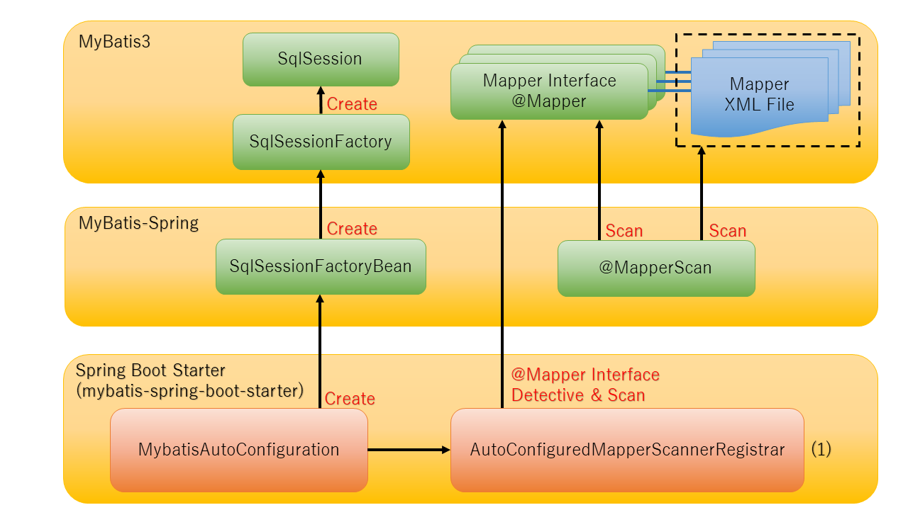

include::_include_all.adoc[]
[[Mybatis3]]

:toc:
:sectnums: 4
:toclevels: 6

= {mybatis}

== {overview}

{mybatis}とは::
DBアクセスに際し、SQL文とオブジェクトのマッピングを行うフレームワークである。 +
SQLとオブジェクトの紐付けは MapperXMLファイル で設定するか、Mapperインターフェースに直接アノテーションで記載する。

{SF}で使用する{mybatis}::
{mybatis}とSpringを連携させるライブラリとして、MyBatisプロジェクトから、 http://www.mybatis.org/spring/[MyBatis-Spring]
が用意されており、{SF}ではこのライブラリを使用する。

{SB}の連携::
{SB}では、Starterを使用することで、{MYSP}の各コンポーネント類の自動設定をする。 +
各コンポーネントの相関関係は下記のとおりである。

[cols="6,70", options="header"]
|===
|項番
|説明

|(1)
|``AutoConfiguredScanRegister``内で自動的にスキャンの処理が行われる。 +
{SB}アプリケーションパッケージ配下に存在する、``@Mapper``アノテーションが付与されたインターフェースがスキャン対象となる。

|===

テストライブラリ::
{mybatis}を利用したコンポーネントなどをテストする時に、必要なコンポーネントのみ読み込むことできる
テスト用のStarterが用意されている。
詳細は<<Mybatis3_how_to_test>>を参照すること。

== {how_to_use}

[[mybatis_starter]]
=== {starter_to_use}
{SB}のStarter(``mybatis-{SBS}``)がMyBatisから、提供されている。 +
{SI}に[MyBatis Framework]が選択肢として用意されているため、
こちらを使用してStarterを依存関係に追加する。

pom.xmlに直接設定したい場合は、 http://www.mybatis.org/spring-boot-starter/mybatis-spring-boot-autoconfigure/#Installation[Mybatisの公式リファレンス] を参照すること。

==== {enable_auto_configuration}
有効になる{AC}は下記のとおり。

[cols="6,70", options="header"]
|===
|クラス名
|概要

|``org.springframework.boot.autoconfigure.`` +
``jdbc.DataSourceAutoConfiguration``
|DataSource周りの設定を行う。 +
<<DataSource.adoc#DataSource,データソース>>を参照すること。

|``org.mybatis.spring.boot.`` +
``autoconfigure.MybatisAutoConfiguration``
|{Mybatis}を使用するための設定を行う。

|===

=== {customization_points}

カスタマイズのポイントとしては、下記のとおり。

* <<Mybatis3_property_based_configuration>>
* <<Mybatis3_bean_based_configuration>>
* <<set_ordinary_xml>>

カスタマイズ内容によっては、同じ設定が複数の手段で実現できるようになっているため注意すること。 +
基本的にはプロパティ設定によるカスタマイズを推奨する。

.Mybatisのカスタマイズ
[cols="2,15,5,5,5", options="header"]
|===
|番号|内容|<<Mybatis3_property_based_configuration>>|<<Mybatis3_bean_based_configuration>>|<<set_ordinary_xml>>

|1
|{mybatis}の挙動の変更(``org.apache.ibatis.session.Configuration``の設定値の変更)
|可能
|可能
|可能

|2
|タイプハンドラの追加
|可能
|可能
|可能

|3
|タイプエイリアスの設定
|可能
|可能
|可能

|4
|SQL実行モード(ExecutorType)の変更したSqlSessionの利用
|可能
|不可
|可能

|5
|プラグインを使ったインタセプタ
|不可
|可能
|可能

|6
|DataBaseIdProviderの利用
|不可
|可能
|可能

|7
|LanguageDriverの変更
|可能
|可能
|可能

|===

上記カスタマイズについて代表的なものについてのみ、下記で詳細に説明する。

[[Mybatis3_property_based_configuration]]
==== {property_based_configuration}
設定値を変更したい場合は、設定値``mybatis.*``を使用する。 +
詳細は、 http://mybatis.org/spring-boot-starter/mybatis-spring-boot-autoconfigure/#Configuration[MyBatisの公式リファレンス]を参照すること。

.代表的な設定値
[cols="6,6,40a", options="header"]
|===

|プロパティ名
|デフォルト値
|概要

|``mybatis.configuration.*``
|-
|{mybatis}の挙動をカスタマイズしたい場合に使用する。 +
設定値は``org.apache.ibatis.session.Configuration`` +
の内容が値として設定される。 +
詳細は、 http://www.mybatis.org/mybatis-3/configuration.html#settings[MyBatisの公式リファレンス]を参照すること。

|``mybatis.type-handlers-package ``
|-
|タイプハンドラを追加したい場合に使用する。 +
BaseTypeHandlerを実装したクラスを格納したパッケージを設定すると、
配下にある実装クラスがすべてタイプハンドラとして使用される。

|``mybatis.type-aliases-package``
|-
|Entityが格納されているパッケージを設定する。 +
SQLをXMLで記述する際、Type属性をFQCNではなく短縮名(エイリアス)で設定可能となる。 +
なお、メソッドアノテーションでSQLを記載する場合は設定不要である。

|``mybatis.executor-type``
|-
|SQL実行モード(ExecutorType)を設定する。 +
下記の設定値が設定可能であり、設定された内容のSqlSessionでDBアクセスが行える。

* SIMPLE :SQL発行ごとにPreparedStatementを都度作成する。
* REUSE : PreparedStatementをキャッシュさせ、再利用する。
* BATCH : 更新をバッチモードで行う。

設定しない場合は、SIMPLEで動作する。

|===

[[Mybatis3_bean_based_configuration]]
==== {bean_based_configuration}
CustomizerによるカスタマイズとBean定義を自動的に追加する機構を持っている。
具体的な例はMyBatisの公式ガイドを確認すること。

.カスタマイズ例
[cols="1,4,12a,8a", options="header"]
|===
|番号
|内容
|説明
|詳細リンク

|1
|ConfigurationCustomizerによるカスタマイズ
|``org.apache.ibatis.session.Configuration``を書き換える用途に使用する。 +
実装クラスを用意し、Bean定義するだけで自動的に
{mybatis}の挙動をカスタマイズできる。 +

| http://mybatis.org/spring-boot-starter/mybatis-spring-boot-autoconfigure/#Using_a_ConfigurationCustomizer[MyBatisの公式リファレンス]

|2
|タイプハンドラの追加
|BaseTypeHandlerを実装したクラスをBean定義すると、TypeHandlerとして自動的に追加される。
|
* BaseTypeHandlerの実装例
+
https://mybatis.org/mybatis-3/configuration.html#typeHandlers[MyBatisの公式リファレンス]

* {SB}におけるBeanの自動検出の例
+
http://mybatis.org/spring-boot-starter/mybatis-spring-boot-autoconfigure/#Detecting_MyBatis_components[MyBatisの公式リファレンス]

|6
|DataBaseIdProviderの利用
|使用するSQLをベンダごとに切り替える仕組みを{mybatis}として持っている。 +
VendorDataBaseIdProviderを実装し、Bean定義するだけで有効になる。
|
* DataBaseIdProviderについて
+
https://mybatis.org/mybatis-3/ja/configuration.html#databaseIdProvider[MyBatisの公式リファレンス]

* {SB}におけるBeanの自動検出
+
http://mybatis.org/spring-boot-starter/mybatis-spring-boot-autoconfigure/#Detecting_MyBatis_components[MyBatisの公式リファレンス]

|===

[[set_ordinary_xml]]
==== {Mybatis}従来の設定ファイル(xml)によるカスタマイズ
{Mybatis}従来の設定ファイルによるカスタマイズも可能である。
``mybatis.config-location``に、{Mybatis}従来の設定ファイルへのパスを指定する。

[source,yaml]
.applicaion.yml
----
mybatis:
  config-location: classpath:/mybatis/mybatis-config.xml
----

./src/main/resources/mybatis/mybatis-config.xml
[source,xml]
----
<?xml version="1.0" encoding="UTF-8"?>
<!DOCTYPE configuration
    PUBLIC "-//mybatis.org//DTD Config 3.0//EN"
    "http://mybatis.org/dtd/mybatis-3-config.dtd">
<configuration>
    <settings>
        <!-- omitted -->
        <setting name="jdbcTypeForNull" value="NULL" />
        <setting name="defaultStatementTimeout" value="20" />
        <setting name="mapUnderscoreToCamelCase" value="true" />
    </settings>
    <typeAliases>
        <package name="com.example"/>
    </typeAliases>
    <typeHandlers>
        <!-- omitted -->
    </typeHandlers>
</configuration>

----

[WARNING]
====
プロパティによるカスタム(``mybatis.configuration.*``)と設定ファイルは
共存させると下記の例外が発生する。 +
[source,CONSOLE]
.CONSOLE出力
----
Caused by: java.lang.IllegalStateException: Property 'configuration' and 'configLocation' can not specified with together
----

従来ある既存システムと設定値を合わせたい等の要件がない限り、<<Mybatis3_property_based_configuration>>を使用し、
設定ファイルによるカスタマイズは使用しないこと。
====

=== {functional_how_to_use}

==== 使用テーブルとEntityについて
{functional_how_to_use}で使用するテーブルレイアウトのSQLとEntityを下記に示す。
カラム名がスネークケースを例に説明を行う。

.DDL(schema.sql)
[source,SQL]
----
create table if not exists user(
  user_id varchar(20) primary key,
  user_name varchar(50)
);
----

.User.java
[source,java]
----
@Data
@AllArgsConstructor
@NoArgsConstructor
public class User  {
    private String userId;
    private String userName;
}

----

==== Mapperの実装について

従来は、``@MapperScan``アノテーションでパッケージの設定をすると、その配下のインターフェースがすべてスキャン対象だった。
{SB}では、下記の条件をすべて満たすMapperインターフェースが自動スキャン対象となる。

* {SB}アプリケーションクラス配下のパッケージ
* ``@org.apache.ibatis.annotations.Mapper``アノテーションが付与されているインターフェース

Mapperインターフェースを実装する方法として下記2パターンで紹介する。

1. <<Mapper_Use1>>
2. <<Mapper_Use2>>

設定されたユーザIDを検索条件にレコードを取得する処理を例に説明する。

[[Mapper_Use1]]
===== メソッドアノテーションを使用する方法

``@Mapper``アノテーションを付与したインターフェースに対して、
メソッドアノテーションを使ってSQL文を定義する。

.UserRepository.java
[source,java]
----
package com.example.user; //(1)

@Mapper //(2)
public interface UserRepository {

    @Select("SELECT user_id,user_name FROM user where user_id=#{userId}") //(3)
    Optional<User> findById(String userId);

}

----

.application.yml
[source,yaml]

----
#(4)
mybatis:
  configuration:
    map-underscore-to-camel-case: true
----

[cols="6,70", options="header"]
|===

|番号
|概要

|(1)
|スキャン対象とするために{SB}アプリケーションクラス配下のパッケージにする。

|(2)
|スキャン対象とするために``@Mapper``アノテーションを付与する。

|(3)
|検索用のメソッドアノテーションを使用し、SQLを記載する。 +
使用できるメソッドアノテーションについては、
http://www.mybatis.org/mybatis-3/ja/java-api.html[MyBatisの公式リファレンス] を参照すること。

|(4)
|テーブルのカラム名がスネークケース、対応するEntityがキャメルケースのため、
{mybatis}の標準機能である、自動マッピングを有効にする。

|===

[[Mapper_Use2]]
===== MapperXMLファイルを使用する方法
``@Mapper``アノテーションを付与したインターフェースを定義し、MapperXMLファイルを作成する。 +
MapperXMLファイルはMapperインターフェースのFQCNに合わせて、クラスパス配下にフルパス指定で格納する。

.UserRepository.java
[source,java]
----
package com.example.user; //(1)

@Mapper //(2)
public interface UserRepository {
    Optional<User> findById(String userId); //(3)
}
----

.UserRepository.xml
[source,xml]
----
<!--(4)-->
<mapper namespace="com.example.user.UserRepository">
    <!--(5)-->
    <select id="findById" parameterType="String" resultType="User">
    <![CDATA[
        SELECT
            user_id,
            user_name
        FROM
            user
        WHERE
            user_id = #{userId}
    ]]>
    </select>
</mapper>
----

.application.yml
[source,yaml]
----
mybatis:
  #(6)
  type-aliases-package: com.example.user
  #(7)
  configuration:
    map-underscore-to-camel-case: true
----

[cols="6,70p", options="header"]
|===

|番号
|概要

|(1)
|スキャン対象とするために{SB}アプリケーションクラス配下のパッケージにする。

|(2)
|スキャン対象とするために``@Mapper``アノテーションを付与する。

|(3)
|DBアクセス用のメソッドを定義する。

|(4)
|MapperXMLファイルとインターフェースの紐付けを行うためnamespaceの設定を行う。 +
また、MapperインターフェースのFQCNに合わせ、MapperXMLファイルの配置先も合わせる。 +
FQCNが``com.example.user.UserRepository``なので、 +
``/src/main/resources/com/example/user/UserRepository.xml``で配置する。

|(5)
|SQLを記載する。 +
MapperXMLファイルの詳細は、
https://mybatis.org/mybatis-3/ja/sqlmap-xml.html#[Mybatisの公式リファレンス] を参照すること。

|(6)
|タイプエイリアスを有効にする。 +
設定値にEntityが格納されているパッケージを設定する。 +
``resultType``属性の設定をFQCNではなく、クラス名だけで省略できるようにする。

|(7)
|テーブルのカラム名がスネークケース、対応するEntityがキャメルケースのため、
{mybatis}の標準機能である、自動マッピングを有効にする。

|===

[NOTE]
====
MapperXMLファイルの格納先を変更することが可能である。 +
設定値``mybatis.mapper-locations``にXMLファイルをフルパス指定で設定することで
デフォルトの挙動を変更することができる。

.application.yml
[source,yaml]
----
mybatis:
  mapper-locations: classpath:/mybatis/mappings/**/*.xml
----
====

=== {customization_example}

==== スキャン対象の変更

===== @Mapperアノテーションがついていないインターフェースのスキャン

``@Mapper``アノテーションがついていないインターフェースをスキャンしたいという要件についても対応が可能である。 +
{SB}アプリケーションクラスに``@MapperScan``アノテーションを付与することで従来のSpring-MyBatisのスキャン機能が有効になる。

ただし、``@MapperScan``アノテーションを付与した場合、設定先パッケージ配下の
インターフェースがすべて対象になるため、Mapperインターフェース以外格納しないこと。

詳細は、 http://mybatis.org/spring/ja/mappers.html#scan[Mybatisの公式リファレンス]を参照すること。

[source,java]
.com.example.UserApplication.java
----
package com.example;

@MapperScan("com.example.mapper") //(1)
@SpringBootApplication
public class UserApplication {
    public static void main(String[] args) {
        // omitted
    }

}
----

[cols="6p,70a", options="header"]
|===
|項番
|概要

|(1)
|``@MapperScan``アノテーションを{SB}アプリケーションクラスに付与し、スキャン対象のパッケージ名を設定する。
``com.example.mapper.*``にあるインターフェースすべてがスキャン対象となる。
|===

===== {SB}アプリケーションパッケージ外のスキャン

``@Mapper``アノテーションが付与されているインターフェースが{SB}アプリケーションクラスパッケージ外にある場合は、
``@MapperScan``アノテーションを使用のうえ、``annotationClass``属性を設定すればよい。

[source,java]
.com.example.UserApplication.java
----
package com.example;

@MapperScan(basePackages="com.xxx.example",annotationClass=Mapper.class) //(1)
@SpringBootApplication
public class UserApplication {
    public static void main(String[] args) {
        // omitted
    }
}
----

[cols="6p,70a", options="header"]
|===
|項番
|概要

|(1)
|``annotationClass``属性を設定する。
``com.xxx.example.*``配下でかつ``@Mapper``アノテーションが付与されているインターフェースがスキャン対象となる。

|===

[[Mybatis3_how_to_test]]
== {test}

=== {test_starter_to_use}
* ``mybatis-{SBS}-test``
+
{mybatis}機能のテスト用に{SB}用のStarterが用意されている。 +
 ``mybatis-{SBS}-test``を依存関係に追加することで使用可能となる。 +
ただし、{SI}では依存関係に追加できない。 +
依存関係に追加するには、 http://mybatis.org/spring-boot-starter/mybatis-spring-boot-test-autoconfigure/#Installation[MyBatisの公式リファレンス]
を参照すること。

=== {test_function}
{Mybatis}で使用できるテストの機能を紹介する。

==== Mapperのテストを行う

Mapperのテストを行う場合は、{Mybatis}のスライスアノテーションである``@MybatisTest``アノテーションをテストクラスに付与する。

``@MybatisTest``アノテーションは、テスト対象MapperをインジェクションするだけでMapperのテストが行えるようになる。 +
具体的にどの機能まで有効になるかは、 http://mybatis.org/spring-boot-starter/mybatis-spring-boot-test-autoconfigure/#Appendix[MyBatisの公式リファレンス]を参照すること。

スライスアノテーションの中に、``@Transactional``が内包されているため、テストクラスに付与する必要はない。 +
テスト用にトランザクション制御が自動で行われ、テスト完了後にRollbackされる。

``@AutoConfigureTestDatabase``が内包されており、テスト用のH2への接続が自動で行われる。 +
ベンダ依存のSQLを使用しているなど、H2以外でテストを行いたい場合は、<<DataSource.adoc#DataSource_how_to_test,データソースのテスト>>を参照すること。

==== テストでMyBatisコンポーネントを有効にする
MyBatisコンポーネントを有効にしたい場合は、``@AutoConfigureMybatis``アノテーションをテストクラスに付与する。 +
他のコンポーネントを有効にするスライスアノテーションと併用する場合に設定する。

=== 使用例

設定されたユーザIDを検索条件にレコードを取得するMapperのテストを例に説明する。

.UserRepositoryTest.java
[source,java]
----
@MybatisTest //(1)
class UserRepositoryTest {

    @Autowired //(2)
    UserRepository userRepository;

    @Test //(3)
    void testFindAll() {

        Optional<User> actual = userRepository.findbyId("test");
        // omitted

    }
}
----

[cols="6,70p", options="header"]
|===

|番号
|概要

|(1)
|``@MybatisTest``をテストクラスに付与する。

|(2)
|``@Autowired``アノテーションで、テスト対象``Mapper``インターフェースをインジェクションする。

|(3)
|テストコードを実装する。``@Transactional``の付与は不要である。

|===
