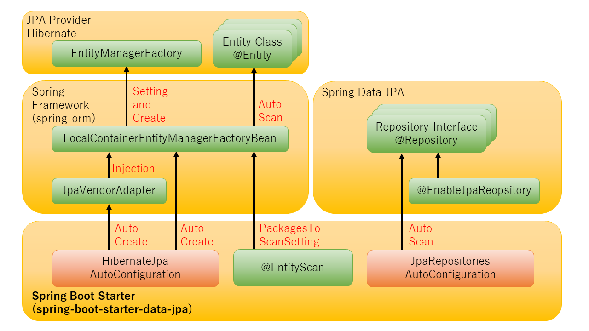

include::_include_all.adoc[]
[[SpringDataJPA]]

:toc:
:sectnums: 4
:toclevels: 6

= {SPDJ}

== {overview}

JPAとは::
DBからレコードの取得やDBに反映する処理をJavaオブジェクトの操作を介して行うJavaEEの仕様がJPA(Java Persistance API)である。 +
実際にアプリケーションで使用するのはJPAプロバイダと呼ばれるJPA実装を使用する。 代表的なJPAプロバイダは、HibernateやEclipseLinkなどがある。

{SF}でJPAプロバイダを使用するには::
{SF}はJPAプロバイダ連携用ライブラリをコア機能として持っている(spring-ormライブラリ)。 +
開発者がEntityManagerの設定をすることでJPAプロバイダと連携可能となる。

{SPDJ}とは::
{SPDJ}は、JPAを用いてDBアクセスを行う処理のRepository実装負荷を軽減してくれるライブラリである。 +
用意されている ``Repository``インターフェースを使用することで、EntityManagerに対する複雑な操作を隠ぺい化する。 +
開発者が``@EnableJpaRepositories``でパッケージを設定することで、配下の``@Repository``インターフェースの検索と自動的にBean定義がされてRepositoryとして振舞うことができる。 +
また、JPAプロバイダで発生した例外を{SF}上で使用できる``DataAccessException``に変換する仕組みももつ。

{SB}の連携::
{SB}では{SPDJ}のStarterが用意されており、spring-ormおよび{SPDJ}を使用するための
複雑な設定とBean定義をすべて自動的に行ってくれる。 +
なお、Hibernate用の{AC}が用意されているが、他JPAプロバイダの{AC}は用意されていない。 +
各コンポーネントの相関関係は下記のとおりである。

== {how_to_use}

[[SPDJ_starter]]
=== {starter_to_use}
{SB}のStarter(``{SBS}-data-jpa``)が提供されている。 +
{SI}に[Spring Data JPA]が選択肢として用意されているため、
こちらを使用してStarterを依存関係に追加する。

=== {enable_auto_configuration}
有効になる{AC}は下記のとおり。

[cols="6,70a", options="header"]
|===
|クラス名
|概要

|``org.springframework.boot.autoconfigure.`` +
``jdbc.DataSourceAutoConfiguration``
|DataSource周りの設定を行う。 +
<<DataSource.adoc#DataSource,データソース>>を参照すること。

|``org.springframework.boot.autoconfigure.`` +
``orm.jpa.HibernateJpaAutoConfiguration``
|Hibernateの設定を行う。

|``org.springframework.boot.autoconfigure.`` +
``data.jpa.JpaRepositoriesAutoConfiguration``
|Repositoryインターフェースのスキャン処理用の設定を行う。

|``org.springframework.boot.autoconfigure.`` +
``dao.PersistenceExceptionTranslationAutoConfiguration``
|JPAプロバイダで発生した例外をSpringのデフォルト例外に変換する機能の設定を行う。

|``org.springframework.boot.autoconfigure.`` +
``data.web.SpringDataWebAutoConfiguration``
|{SD}が提供している機能(SortとPageableなど)をページ検索画面で使用できるようにするための設定を行う。 +
``{SBSW}``のStarterも一緒に依存関係に含まれると有効になる。

|===

=== {customization_points}

{customization_points}は、下記のとおりである。

* <<SPDJ_property_based_configuration>>
* <<SPDJ_bean_based_configuration>>

[[SPDJ_property_based_configuration]]
==== {property_based_configuration}
設定値を変更したい場合は、設定値``spring.jpa.*``を使用する。

.代表的な設定値
[cols="1,10a,40a", options="header"]
|===

|プロパティ名
|デフォルト値
|概要

|``spring.jpa.hibernate.ddl-auto``
|-
|HibernateのDB初期化機能のモードを設定する。 +

* update : テーブルが存在しなければ自動的に作成する。
* create-drop : 削除して再作成する。
* none : 何もしない。

設定しない場合は、接続するDBがH2の場合はcreate-dropで動作し、
それ以外のDBに接続する場合はnoneで動作する。

|``spring.jpa.show-sql``
|false
|実行時に発行されたSQLをログに出力するかを設定する。

|``spring.jpa.open-in-view``
|true
|Open Session in Viewの使用有無を設定する。 +
有効にすると、OpenEntityManagerInViewInterceptorのBean定義が行われてOpen Session in Viewが機能する。 +
画面上でEntityを参照したい場合は有効を推奨する。

Open Session in Viewとは::
FetchTypeがLazyFetchの場合、Serviceでトランザクションが終了すると同時にHibernateのSession
もcloseされるためView層でEntityの中身が参照できなくなる。 +
HibernateのSessionの有効範囲をView層まで伸ばし、画面でもEntityの中身が確認できるようにする対応がOpen Session in Viewである。

|``spring.jpa.database-platform``
|-
|Dialectクラスを設定することで、DB製品特有のSQL方言を吸収できるようになる。 +
設定しない場合は、JDBCのドライバクラスから自動検出したDB製品のDialectクラスが指定される。

|``spring.jpa.hibernate.naming.physical-strategy``
|-
|Entityのクラス・フィールド名とDBのテーブル・カラム名のマッピングのルールを設定する。 +
``org.hibernate.boot.model.naming.PhysicalNamingStrategy``を継承したクラスをFQCNで設定する。

設定しない場合は、``org.springframework.boot.orm.jpa.hibernate.SpringPhysicalNamingStrategy``が動作する。 +
``SpringPhysicalNamingStrategy``はEntityがキャメルケース、DBのテーブル・カラム名がスネークケースで対応されている。

|``spring.jpa.properties.*``
|-
|JPAプロバイダに直接渡す設定値を設定する。
Hibernateの設定値は、
https://docs.jboss.org/hibernate/orm/5.4/userguide/html_single/Hibernate_User_Guide.html#configurations[Hibernateの公式リファレンス]
を参照すること。

|===

[WARNING]
====
https://docs.jboss.org/hibernate/orm/5.4/userguide/html_single/Hibernate_User_Guide.html#configurations[JPAプロバイダに直接渡すプロパティ](spring.jpa.properties.\*)と、
同じ目的用途で {reference_url}/#data-properties[{SB}用に用意されたプロパティ](例えば、``spring.jpa.hibernate.*``)
が存在する。 +
後者の設定値は自動的にJPAプロバイダに設定される。その場合、前者は無効となる可能性があるため、後者を使用すること。

上記パターンに該当する、PhysicalNamingStrategyをカスタマイズする場合を例に説明する。

.JPAプロバイダに直接渡すプロパティ
[cols="10,20a,40", options="header"]
|===
|設定の有効・無効
|プロパティ名
|デフォルト値

|無効
|``spring.jpa.properties.hibernate.`` +
``physical_naming_strategy``
|-

|===

.{SB}用に用意されたプロパティ
[cols="10,20a,40", options="header"]
|===
|設定の有効・無効
|プロパティ名
|デフォルト値

|有効
|``spring.jpa.hibernate.naming.`` +
``physical-strategy``
|``org.springframework.boot.orm.jpa.hibernate.`` +
``SpringPhysicalNamingStrategy``

|===

====

[[SPDJ_bean_based_configuration]]
==== {bean_based_configuration}
Customizerが用意されており、Java実装ベースでカスタマイズが行える。 +
下記のインターフェースを継承したクラスでカスタマイズを実装し、Bean定義するだけで有効になる。

[cols="10,20", options="header"]
|===
|インターフェース名
|説明

|``org.springframework.boot.autoconfigure.`` +
``orm.jpa.EntityManagerFactoryBuilderCustomizer``
|EntityManagerFactoryBuilderのカスタマイズができる。

|``org.springframework.boot.autoconfigure.`` +
``orm.jpa.HibernatePropertiesCustomizer``
|HibernatePropertiesのカスタマイズができる。

|===

=== {functional_how_to_use}

==== 使用テーブルについて
{functional_how_to_use}で使用するテーブルレイアウトのSQLを下記に示す。 +
アクセスするDBはH2で、テーブルのカラム名がスネークケースを例に説明を行う。

.DDL(schema.sql)
[source,SQL]
----
create table if not exists user(
  user_id varchar(20) primary key,
  user_name varchar(50),
  user_age int
);
----

[NOTE]
====
DB初期化処理は、データソースが行う機能と、Hibernateが行う機能があり、
H2の場合はデフォルトで両方のDB初期化処理が有効になってしまう。 +
schema.sqlを用意してテーブル作成をするような場合は、HibernateのDB初期化処理を無効にする。

.application.yml
[source,yaml]
----
spring:
  jpa:
    hibernate:
      #(1)
      ddl-auto: none
----

[cols="6,70", options="header"]
|===
|番号
|概要

|(1)
|``spring.datasource.initiailze-mode``のデフォルト値が有効(Embedded)なため、 +
HibernateのDB初期化処理を無効にする。
|===

====

==== Entityの実装について

{SF}では、Entityをスキャンする機能があり、パッケージの設定が必要だったが、 +
{SB}アプリケーション配下のパッケージであれば設定は不要である。

.User.java
[source,java]
----
package com.example.user;//(1)

@Data
@AllArgsConstructor
@NoArgsConstructor
@Entity //(2)
public class User {
    @Id //(3)
    private String userId; //(4)
    private String userName;
    private Integer userAge;
}
----

[cols="6,70", options="header"]
|===
|番号
|概要

|(1)
|スキャン対象とするために、{SB}アプリケーションクラス配下のパッケージにする。

|(2)
|スキャン対象とするために、``@Entity``アノテーションを付与する。

|(3)
|キーになるフィールドには必ず``@Id``アノテーションを付与する。 +
Entityクラスには必ず1つ必要である。

|(4)
|SpringPhysicalNamingStrategyがデフォルトで有効なため、フィールド名はキャメルケースで定義する。

|===

==== Repositoryの実装について

{SF}では、Repositoryをスキャンする機能があり、パッケージの設定が必要だったが +
{SB}アプリケーション配下のパッケージであれば設定は不要である。

``Repository``インターフェースを実装する方法として下記2パターンで紹介する。

1. <<CrudRepositoy_Use>>
2. <<JPQL_Use>>

[[CrudRepositoy_Use]]
===== CrudRepositoryのメソッドを使用する方法

レコード全件取得する処理を例に説明する。

``CrudRepository``を継承したインターフェースを用意し、
``@Repository``アノテーションを付与してRepositoryを作成する。

.UserRepository.java
[source,java]
----
package com.example.user; //(1)

@Repository //(2)
public interface UserRepository extends CrudRepository<User, String> /*(3)*/{
}

----

[cols="6,70", options="header"]
|===

|番号
|概要

|(1)
|スキャン対象とするために、{SB}アプリケーションクラス配下のパッケージにする。

|(2)
|スキャン対象とするために、``@Repository``アノテーションを付与する。

|(3)
|``CrudRepository``を継承した``UserRepository``を用意する。 +
``CrudRepository``は汎用的なCRUD操作がすでに定義されており、
``findAll``という全件取得のメソッドがあるため、中身は空でよい。 +
``CrudRepository``のメソッドについては、
https://docs.spring.io/spring-data/data-commons/docs/current/api/org/springframework/data/repository/CrudRepository.html[CrudRepositoryのJavaDoc]
を参照すること。

|===

業務ロジックで上記Repositoryを使用し、全件取得をする例は下記のとおりである。

.UserService.java
[source,java]
----
@Service
public class UserServiceImpl implements UserService {

    @Autowired //(1)
    public UserRepository userRepository;

    @Override
    @Transactional(readOnly = true)
    public Iterable<User> findAll() {
        return userRepository.findAll(); //(2)
    }
}
----

[cols="6,70", options="header"]
|===

|番号
|概要

|(1)
|``@Autowired``アノテーションで、使用するRepositoryをインジェクションする。

|(2)
|全件取得のメソッドを呼び出す。 取得されたEntityはEntityManagerによって管理されている状態である。

|===

[[JPQL_Use]]
===== @Queryメソッドを使用したDBアクセス
JPQLを使用したアクセスについて説明する。 +
指定された年齢より年上のUserレコードを取得する処理を例に説明する。

.UserRepository.java
[source,java]
----
package com.example.user;

@Repository //(1)
public interface UserRepository extends CrudRepository<User, String> /*(2)*/{

    @Query("SELECT u FROM User u WHERE u.userAge > :age") //(3)
    List<User> findByAgeOlderThan(Integer age);
　
}

----

[cols="10,70", options="header"]
|===

|番号
|概要

|(1)
|スキャン対象とするために``@Repository``アノテーションを付与する。

|(2)
|``CrudRepository``の型を継承した``UserRepository``を用意する。 +
なお、``CrudRepository``のメソッドを使う要件でなければ、
``org.springframework.data.Repository``インターフェースを継承しても問題ない。

|(3)
|操作するメソッドに対し、``@Query``アノテーションを付与し、アクセスするJPQLを記載する。

|===

=== {customization_example}

==== スキャン対象の変更
[[Change_Scan]]
===== {SB}アプリケーションパッケージ外のスキャン

{SB}アプリケーションパッケージ外にある``@Entity``アノテーション、または``@Repository``アノテーションを
スキャン対象にしたい要件の場合、スキャン用アノテーションが用意されている。

.使用するスキャン用のアノテーション
[cols="7a,10a,20", options="header"]
|===
|対象
|アノテーション名
|概要

|``@Entity``に対するスキャン
|``@EntityScan``
|属性値にパッケージを設定すると、Entityのスキャン対象になる。 +
{SB}が提供するアノテーション。 +

|``@Repository``に対するスキャン
|``@EnableJpaRepository``
|属性値にパッケージを設定すると、Repositoryのスキャン対象になる。 +
{SPDJ}標準のアノテーション。

|===

[source,java]
.com.example.UserApplication.java
----
package com.example;

@EntityScan("com.xxx.entity") //(1)
@EnableJpaRepository("com.xxx.repository") //(2)
@SpringBootApplication
public class UserApplication {
    public static void main(String[] args) {
        // omitted
    }
}
----

[cols="6p,70a", options="header"]
|===
|項番
|概要

|(1)
|``com.xxx.entity``配下の``@Entity``クラスを有効にする。

|(2)
|``com.xxx.repository``配下の``@Repository``クラスを有効にする。

|===

==== Dialectの変更
システムで使用するDB製品に対しバージョン差異で影響が出る処理を行う場合、
Dialectを変更して対応することが可能である。 +
``spring.jpa.database-platform``にDialectクラスを設定する。

Hibernateで用意されているDialectクラスを設定する。
https://docs.jboss.org/hibernate/orm/5.4/userguide/html_single/Hibernate_User_Guide.html#database-dialect[Hibernateの公式リファレンス]
を参照すること。 +
なお、Dialectを継承した独自実装クラスを設定することも可能である。

postgreSQL9.2の方言を吸収したい場合は下記のように設定する。

[source,yaml]
.applicaion.yml
----
spring:
  jpa:
    database-platform : org.hibernate.dialect.PostgreSQL92Dialect

----

[[SPDJ_how_to_test]]
== {test}

=== {test_starter_to_use}
* ``{SBS}-test``

=== {test_function}
{SPDJ}で使用できるテストの機能を紹介する。

==== Repositoryのテストを行う
Repositoryのテストを行う場合は、{SPDJ}のスライスアノテーションである``@DataJpaTest``アノテーションをテストクラスに付与する。

``@DataJpaTest``アノテーションは、テスト対象RepositoryをインジェクションするだけでRepositoryのテストが行えるようになる。
具体的にどの機能まで有効になるかは、 {reference_url}#test-auto-configuration[公式リファレンス]を参照すること。

スライスアノテーションの中に、``@Transactional``が内包されているため、テストクラスに付与する必要はない。 +
テスト用にトランザクション制御が自動で行われ、テスト完了後にRollbackされる。

``@AutoConfigureTestDatabase``が内包されており、テスト用のH2への接続が自動で行われる。 +
NativeQueryを使用し、DBベンダ依存の書きかたをしているRepositoryなど、H2以外でテストを行いたい場合は、
<<DataSource.adoc#DataSource_how_to_test,データソースのテスト>>を参照すること。

==== テストで{SPDJ}のコンポーネントを有効にする。
{SPDJ}のコンポーネントを有効にしたい場合は、``@AutoConfigureDataJpa``アノテーションをテストクラスに付与する。 +
他のコンポーネントを有効にするスライスアノテーションと併用する場合に設定する。

==== TestEntityManagerを使用する
Entityのテスト用データを用意する``TestEntityManager``が用意されている。 +
``@AutoConfigureTestEntityManager``をテストクラスに付与することで、``TestEntityManager``をインジェクションすることが可能になる。 +
他のコンポーネントを有効にするスライスアノテーションと併用して``TestEntityManager``を使う場合に設定する。

=== 使用例

``@DataJpaTest``を使用して全件取得を行うテストを例に説明する。

.UserRepositoryTest.java
[source,java]
----
@DataJpaTest //(1)
class UserRepositoryTest {

    @Autowired //(2)
    UserRepository userRepository;

    @Autowired //(3)
    TestEntityManager em;

    @Test //(4)
    void testFindAll() {

        em.persist(new User("0009","Taro",23)); //(5)
        em.persist(new User("0010","Jiro",16));
        Iterable<User> actual = userRepository.findAll();
        // omitted
    }
}
----

[cols="6,70p", options="header"]
|===

|番号
|概要

|(1)
|``@DataJpaTest``をテストクラスに付与する。

|(2)
|``@Autowired``アノテーションで、テスト対象Repositoryをインジェクションする。

|(3)
|``@Autowired``アノテーションで、``TestEntityManager``をインジェクションする。
|(4)
|テストコードを実装する。``@Transactional``の付与は不要である。

|(5)
|テスト準備として、``TestEntityManager``を使ってレコードを登録する。 +
例は、事前に2レコードが用意された状態である。

|===
