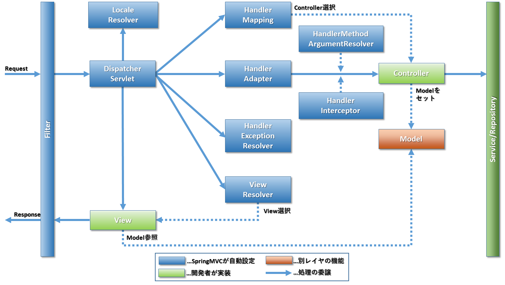

include::_include_all.adoc[]

[[SpringMVC]]

:sectnums: 4
:toclevels: 6

= {SM}

[[SpringMVC_Overview]]
== {overview}

{SB}における{SM}の{overview}について説明する。 +
{SM}では、``{SBSW}``によって対応する{AC}が機能し、開発者は初期設定などを意識せず使用できる。 +
 +
{SM}によって提供される主要コンポーネントとその関係を下記に示す。

[cols="20,70", options="header"]
.{SM}が提供する主要なコンポーネント
|===
|コンポーネント名
|概要

|``{DS}``
|リクエストを受け取り適切なコンポーネントに処理を委譲する。 +
詳細は<<SpringMVC_DispatcherServlet,DispatcherServlet>>を参照すること。

|``HandlerMapping``
|``{DS}``から委譲されたリクエストに対して適切なControllerを選定する。 +
詳細は<<SpringMVC_HandlerMapping,HandlerMapping>>を参照すること。

|``HandlerAdapter``
|``HandlerMapping``で選定されたControllerの処理を呼び出す。 +
詳細は<<SpringMVC_HandlerAdapter,HandlerAdapter>>を参照すること。

|``HandlerInterceptor``
|Controllerのメソッド実行時に任意の処理を差しはさむ。 +
詳細は<<SpringMVC_HandlerInterceptor,HandlerInterceptor>>を参照すること。

|``HandlerMethodArgumentResolver``
|Controllerのメソッドが受け取る引数をバインドする。 +
詳細は<<SptirngMvc_ArgumentResolver,HandlerMethodArgumentResolver>>を参照すること。

|``HandlerExceptionResolver``
|``{DS}``以下で発生した例外のハンドリングを行う。 +
詳細は<<SpringMVC_HandlerExceptionResolver,HandlerExceptionResolver>>を参照すること。

|``ViewResolver``
|設定されたView名をマッピングする。 +
詳細は<<SpringMVC_ViewResolver,ViewResolver>>を参照すること。

|``LocaleResolver``
|リクエストに設定されているLocaleの解決を行う。 +
詳細は<<SpringMVC_LocaleResolver,LocaleResolver>>を参照すること。

|``Filter``
|ServletFilter機能を利用して、リクエストが伝搬してくる時に処理を差しはさむ。 +
詳細は<<SpringMVC_Filter,Filter>>を参照すること。

|===

次節以降に、{SB}で、{SM}を有効にした際に用意される各コンポーネントの機能を紹介する。 +
[[SpringMVC_DispatcherServlet]]
=== DispatcherServlet
リクエストを受け取り、適切な{SM}のコンポーネントに処理を委譲し、レスポンスを組み立てる。 +
使用するコンポーネントの登録などは、基本的に{AC}などで行われるため、意識する必要はない。

[[SpringMVC_HandlerMapping]]
=== HandlerMapping
``{DS}``から委譲されたリクエストに対して適切なControllerを選定し、``{DS}``に返却する。 +
選定方法に応じて複数の機能が存在する。下記に代表的な機能を示す。 +

[cols="50,40,10", options="header"]
.HandlerMappingに用意されている機能
|===
|機能
|対応クラス
|デフォルト値

|``@RequestMapping``によるマッピング機能
|``org.springframework.web.servlet.`` +
``mvc.method.annotation.RequestMappingHandlerMapping``
|有効

|index.htmlに対するマッピング機能
|``org.springframework.boot.autoconfigure.`` +
``web.servlet.WelcomePageHandlerMapping``
|有効

|===

``RequestMappingHandlerMapping``によるマッピングは、コンポーネントスキャン時に``@RequestMapping``アノテーションを読み取り設定されるため、特に設定を行う必要はない。 +

[[SpringMVC_HandlerAdapter]]
=== HandlerAdapter
``{DS}``は``HandlerMapping``によってマッピングされたメソッドに対して、処理を委譲する。 +
しかし、実際は``{DS}``が直接マッピングされたメソッドを呼び出すのではなく、``HandlerAdapter``を介して呼び出す。 +
マッピングに対応した複数の機能が存在する。下記に代表的な機能を示す。

[cols="50,40,10", options="header"]
.HandlerAdapterに用意されている機能
|===
|機能
|対応クラス
|デフォルト値

|``@RequestMapping``が付与されたメソッドに処理を委譲する機能
|``org.springframework.web.servlet.`` +
``mvc.method.annotation.RequestMappingHandlerAdapter``
|有効
|===

[[SpringMVC_HandlerInterceptor]]
=== HandlerInterceptor
Controllerのメソッドへの委譲時に任意の処理を差しはさむ。 +
複数の機能が用意されているため、下記に代表的な機能を示す。

[cols="60,30,10", options="header"]
.HandlerInterceptorに用意されている機能
|===
|機能
|対応クラス
|デフォルト値

|``ConversionService``をリクエストスコープに追加する機能
|``org.springframework.web.servlet.`` +
``handler.ConversionServiceExposingInterceptor``
|有効
|===

[[SptirngMvc_ArgumentResolver]]
=== HandlerMethodArgumentResolver
Controllerのメソッドに``{DS}``からアクセスがあった際に、メソッドの引数に指定されているオブジェクトのマッピングを行う。 +
機能が非常に多いため、下記に代表的な機能を示す。

[cols="60,30,10", options="header"]
.HandlerMethodArgumentResolverに用意されている機能
|===
|機能
|対応クラス
|デフォルト値

|``@RequestParam``が付与されたオブジェクトとリクエストパラメータの値をバインドする機能
|``org.springframework.web.method.`` +
``annotation.RequestParamMethodArgumentResolver``
|有効

|``@PathVariable``が付与されたオブジェクトとURLパラメータをバインドする機能
|``org.springframework.web.servlet.`` +
``mvc.method.annotation.PathVariableMethodArgumentResolver``
|有効
|===

[[SpringMVC_HandlerExceptionResolver]]
=== HandlerExceptionResolver
``{DS}``以下で例外が発生したときに呼び出され、例外のハンドリングを行う。 +
複数機能が用意されているため、下記に代表的な機能を示す。 +
例外ハンドリング自体については<<ErrorHandling.adoc#ErrorHandling,例外ハンドリング>>を参照すること。

[cols="50,40,10", options="header"]
.HandlerExceptionResolverに用意されている機能
|===
|機能
|対応クラス
|デフォルト値

|``@ExceptionHandler``の付与されたメソッドに処理を委譲する機能
|``org.springframework.web.servlet.`` +
``mvc.method.annotation.ExceptionHandlerExceptionResolver``
|有効

|``@ResponseStatus``が付与された例外クラスをハンドリングする機能
|``org.springframework.web.servlet.`` +
``mvc.annotation.ResponseStatusExceptionResolver``
|有効

|フレームワーク例外をハンドリングする機能
|``org.springframework.web.servlet.`` +
``mvc.support.DefaultHandlerExceptionResolver``
|有効
|===

[[SpringMVC_ViewResolver]]
=== ViewResolver
``{DS}``から伝えられたViewNameから返却するViewをマッピングする。 +
Viewの種類によって複数の機能が用意されているため、下記に代表的な機能を示す。

[cols="50,40,10", options="header"]
.ViewResolverに用意されている機能
|===
|機能
|対応クラス
|デフォルト値

|リクエストとViewNameから要求されたコンテンツを解決し、適切なResolverに処理を委譲してViewをマッピングする機能
|``org.springframework.web.servlet.`` +
``view.ContentNegotiatingViewResolver``
|有効

|渡されたViewNameとBean名をマッピングする機能
|``org.springframework.web.servlet.`` +
``view.BeanNameViewResolver``
|有効

|渡されたViewNameをパスに変換してマッピングする機能
|``org.springframework.web.servlet.`` +
``view.InternalResourceViewResolver``
|有効
|===

また、この他に{TH}などのテンプレートエンジンに対応した``ViewResolver``が用意されており、対応するStarterが存在する際に有効になる。
詳細は<<Thymeleaf#Thymeleaf_Starters,Thymeleaf>>を参照すること。

[[SpringMVC_LocaleResolver]]
=== LocaleResolver
リクエストパラメータなどに設定されているLocaleの情報からマッピングを行う。 +
複数機能が用意されているため、下記に代表的な機能を示す。

[cols="60,30,10", options="header"]
.LocaleResolverに用意されている機能
|===
|機能
|対応クラス
|デフォルト値

|HTTPヘッダーのAccept-Languageに指定されているLocaleを利用する機能
|``org.springframework.web.servlet.`` +
``i18n.AcceptHeaderLocaleResolver``
|有効

|常に同じLocaleを利用する機能
|``org.springframework.web.servlet.`` +
``i18n.FixedLocaleResolver``
|無効
|===

[[SpringMVC_Filter]]
=== Filter
{SB}で用意されている``Filter``は他にもあるが、{GL}では``spring.mvc.*``プロパティで設定可能なものと代表的な機能を下記に紹介する。 +

[cols="50,40,10", options="header"]
.Filterに用意されている機能
|===
|機能
|対応クラス
|デフォルト値

|リクエストの文字コードを指定する機能
|``org.springframework.boot.web.`` +
``servlet.filter.OrderedCharacterEncodingFilter``
|有効

|リクエストに格納されたHTTPメソッドを差し替える機能
|``org.springframework.boot.web.`` +
``servlet.filter.OrderedHiddenHttpMethodFilter``
|有効

|HTTPメソッドのPUT/DELETE/PATCHを利用できるようにする機能
|``org.springframework.boot.web.`` +
``servlet.filter.OrderedFormContentFilter``
|有効

|リクエストの情報をスレッドローカルに設定する機能
|``org.springframework.boot.web.`` +
``servlet.filter.OrderedRequestContextFilter``
|有効

|``MultiPartResolver``を介してファイルアップロードなどを解決する機能
|``org.springframework.web.multipart.`` +
``support.MultiPartFilter``
|無効

|===

``MultiPartFilter``はデフォルトで無効になっているため、機能を利用する際は有効にする必要がある。

[[SpringMVC_Others]]
=== その他

[[SpringMVC_Others_ContentsNegotiation]]
==== コンテンツネゴシエーション
{SM}内でコンテンツネゴシエーションがどのように行われているか説明する。 +
 +
{SM}では、コンテンツネゴシエーションは、``ContentNegotiationManager``によって行われる。 +
``ContentNegotiationManager``は``HandlerMapping``から呼び出され、リクエストがもつ情報から適切なコンテンツを返却する
Controllerへのマッピングを行う。 +
``ContentNegotiationManager``は、実際にどの情報によってマッピングを行うかのルール(``ContentNegotiationStrategy``)を持ち、このルールでマッピングを行う。 +
{SM}はデフォルトで複数のルールを用意しているため、下記に代表的なルールを示す。

[cols="60,30,10", options="header"]
.コンテンツネゴシエーションのルール
|===
|ルール
|対応クラス
|デフォルト値

|ヘッダーに設定されたAccept要素で指定されたコンテンツタイプでマッピングする。
|``org.springframework.web.accept.`` +
``HeaderContentNegotiationStrategy``
|有効
|===

[[SpringMVC_Others_EventListner]]
==== EventListner
{SM}では、``EventLisnter``によって、{SM}内で発生したイベントを管理している。
{SM}内では``ApplicationEvent``インターフェースを実装した各種イベントが発生することがある。(例:``ApplicationContext``スタート時、リフレッシュ時など) +
この時に発生した``ApplicationEvent``は、対応した``EventListner``により操作が行われる。
``@Eventlistner``をメソッドに付与してアノテーションベースで``Listener``を作成することもできる。

[[SpringMVC_HowToUse]]
== {how_to_use}

[[SpringMVC_HowToUse_Starter]]
=== {starter_to_use}
{SM}を有効にするために下記に示すStarterをpom.xmlに追加する。

- ``{SBSW}``

[[SpringMVC_HowToUse_AutoConfiguration]]
=== {enable_auto_configuration}
``{SBSW}``のStarterで{enable_auto_configuration}の中で{SM}の機能に重要なものを下記に示す。

[cols="30,70", options="header"]
.代表的な{enable_auto_configuration}
|===
|クラス名
|概要

|``org.springframework.boot.autoconfigure.`` +
``web.servlet.DispatcherServletAutoConfiguration``
|``{DS}``の設定を行いオブジェクトを生成する。

|``org.springframework.boot.autoconfigure.`` +
``web.servlet.WebMvcAutoConfiguration``
|SpringMVC全体の設定を行う。

|``org.springframework.boot.autoconfigure.`` +
``web.servlet.error.ErrorMvcAutoConfiguration``
|ErrorControllerやErrorAttributesなど例外ハンドリングに関連する設定を行う。

|``org.springframework.boot.autoconfigure.`` +
``web.servlet.WebMvcProperties``
|SpringMVCに関連するプロパティを保持する。
|===

[[SpringMVC_HowToUse_CustomizePoint]]
=== {customization_points}

[[SpringMVC_HowToUse_CustomizePoint_Property]]
==== {property_based_configuration}
``spring.mvc.*``に設定可能な多数のプロパティが用意されている。 +
詳細は {reference_url}#web-properties[公式リファレンス]を参照すること。

[[SpringMVC_HowToUse_CustomizePoint_JavaConfig]]
==== {bean_based_configuration}
Bean定義による{SM}のカスタマイズは複数の方法が存在する。 +
下記にカスタマイズ方法を示す。

[[SpringMVC_HowToUse_CustomizePoint_Configurer]]
WebMvcConfigurerによるカスタマイズ::
``WebMvcConfigurer``インターフェースを``@Configuration``を付与して実装することで、{SM}のカスタマイズができる。 +
下記に代表的なメソッドを示す。

[CAUTION]
``@EnableWebMvc``アノテーションを付与すると``WebMvcAutoConfiguration``による初期設定が一部無効になってしまうため注意する。

[cols="30,70", options="header"]
.WebMvcConfigurer
|===
|メソッド名
|概要

|addInterceptors
|``HandlerInterceptor``の追加を行う

|addViewControllers
|ViewControllerの追加を行う

|addArgumentResolvers
|``ArgumentResolver``の追加を行う

|===

[[SpringMVC_HowToUse_CustomizePoint_JavaConfig_Implementation]]
実装クラスのBean定義によるカスタマイズ::
下記に示すコンポーネントに関しては、実装クラスをBean定義することで、自動的に{SM}に追加される。

* ``HandlerMapping``
* ``HandlerAdapter``
* ``HandlerExceptionResolver``

[[SpringMVC_HowToUse_CustomizePoint_JavaConfig_FilterRegistration]]
FilterRegistrationBeanのBean定義によるカスタマイズ::
``Filter``に関しては、直接Bean定義するのではなく、``FilterRegistrationBean``でラップして登録することで、適用順や適用するパスを柔軟に設定できる。

[[SpringMVC_HowToUse_Implementation]]
=== {functional_how_to_use}
Controllerを実装し、Viewとして返却する例を紹介する。 +
返却するViewに関しては、例として静的なHTMLとする。 +
 +
まず、Controllerとして下記を実装する。
[source,java]
.HelloController.java
----

@Controller //(1)
public class HelloController {

    @GetMapping("hello") //(2)
    public String returnHelloHtml() {
        return "hello.html"; //(3)
    }

}
----
[cols="10,90",options="header"]
|===
|項番
|概要

|(1)
|Controllerとして登録するため、``@Contrller``アノテーションを付与する。

|(2)
|パスとHTTPメソッドをマッピングするためにアノテーションで設定を記述する。

|(3)
|View名を返す。 +
ここで返されたView名を使用して``ViewResolver``が適切なリソースを選択する。 +
|===

また、``src/main/resource/static``配下に下記のHTMLを配置する。
[source,html]
.hello.html
----
<!DOCTYPE html>
<html lang="ja">
    <head>
        <meta charset="UTF-8">
        <title>Hello SpringMVC</title>
    </head>
    <body>
        
Hello SpringMVC

    </body>
</html>
----

``/hello``にブラウザからアクセスした際にhello.htmlの内容が表示される。

[[SpringMVC_HowToUse_Customize]]
=== {customization_example}
ViewControllerを追加する手順について説明する。 +
ViewControllerは、マッピングされたURIに対して、単純にView名を返すだけのControllerである。 +
今回のカスタマイズ例では、``/viewhello``というURIに<<SpringMVC_HowToUse_Implementation,{functional_how_to_use}>>で作成したhello.htmlに直接マッピングを行う例を示す。 +
設定方法としては、下記に示す``WebMvcConfigurer``の実装クラスを用意するだけである。 +

[source,java]
.ViewControllerConfigurer
----
@Configuration //(1)
public class ViewControllerConfigurer implements WebMvcConfigurer /*(2)*/{

    public void addViewControllers(ViewControllerRegistry registry) /*(3)*/{
        registry.addViewController("/viewhello") //(4)
                .setViewName("hello.html"); //(5)
    }
}
----
[cols="10,90",options="header"]
|===
|項番
|概要

|(1)
|設定クラスとしてBean定義するために``@Configuration``アノテーションを付与する。

|(2)
|``WebMvcConifgurer``インターフェースを実装する。

|(3)
|カスタマイズ対象に対応したメソッドを実装する。

|(4)
|ViewControllerを有効にするパスを設定する。

|(5)
|リクエストが来た際に返却するView名を設定する。
|===

[[SpringMVC_Test]]
== {test}
{SB}では、<<SpringBoot_architecture.adoc#Architecture_Test,{SB}の主要な機能>>で説明したように、アプリケーションの各レイヤのテストを行う機能を提供している。 +
その1つである{SM}のレイヤをテストする方法を説明する。 +

[[SpringMVC_Test_Starter]]
=== {test_starter_to_use}
- ``{SBS}-test``

[[SpringMVC_Test_Feature]]
=== {test_function}
{SM}で使用できるテストの機能を紹介する。

[[SpringMVC_Test_Feature_SpringBootTest]]
==== アプリケーション全体のテストを行う
テストクラスに対して``@SpringBootTest``アノテーションを付与することで、アプリケーション全体のテストを行うことができる。 +
しかし、{SM}と関係しないアプリケーション内の他の機能も有効になってしまうことに注意が必要である。 +
{SM}のテストを行う場合は、``@WebMvcTest``を付与してテストすることを推奨する。 +
 +
また、``@SpringBootTest``のデフォルト設定では``ErrorController``による例外ハンドリングは有効にならない。 +
詳細は<<ErrorHandling.adoc#ErrorHandling_HowToTest,例外ハンドリング>>の節を参照すること。

[[SpringMVC_Test_Feature_WebMvcTest]]
==== {SM}コンポーネントのみのテストを行う
``@WebMvcTest``では、アプリケーションサーバにデプロイせず、``{DS}``及びService/Repositoryを除く{SM}コンポーネントの挙動を確認するテストが実行できる。また、``MockMvc``がBeanに登録される。 +
具体的にどの機能まで有効になるかは {reference_url}#test-auto-configuration[公式リファレンス]を参照すること。
 +
なお、``ErrorController``による例外ハンドリングはデフォルトでは有効にならないことは注意が必要である。 +
``ErrorController``による例外ハンドリングを含めたテストに関しては<<ErrorHandling.adoc#ErrorHandling_HowToTest,例外ハンドリング>>の節で説明を行う。
 +
また``@WebMvcTest``は何も指定しない場合は、``@Controller``アノテーションが付与されたクラスがすべて有効になる。 +
``@WebMvcTest``のcontrollers要素にControllerクラスを指定することで、対象クラスのみ有効にできる。 +
そのため、テスト実行時には、テスト対象のControllerを指定することを推奨する。

[[SpringMVC_Test_Feature_AutoConfigureMockMvc]]
==== MockMvcを利用する
``@WebMvcTest``を用いたテスト以外で``MockMvc``を使用したい場合は``@AutoConfigureMockMvc``を使用することで、有効になる。 +

[[SpringMVC_Test_Implementation]]
=== {test_how_to_use}
<<SpringMVC_HowToUse_Implementation,{functional_how_to_use}>>で示した``HelloController``に対してテストを行う例を説明する。 +
``/hello``にアクセスし、{HSC}は``200``と期待するView名であるhello.htmlが返ることを確認する。 +

[source,java]
.HelloControllerTest.java
----
@WebMvcTest(controllers = HelloController.class) //(1)
public class HelloControllerTest {

    @Autowired
    MockMvc mockMvc; //(2)

    @Test
    public void test() throws Exception {

        mockMvc.perform(get("/hello")) //(3)
            .andExpect(status().isOk()) //(4)
            .andExpect(view().name("hello.html")); //(5)
    }

}
----
[cols="10,90",options="header"]
|===
|項番
|概要

|(1)
|``@WebMvcTest``のcontrollers要素で有効にするControllerを``HelloController``だけにして{SM}のテストを行う。

|(2)
|``@WebMvcTest``で``MockMvc``が有効になっているため、``@Autowired``で取得できる。

|(3)
|``/hello``に対してgetメソッドでリクエストを送る。

|(4)
|{HSC}は``200``が返ることを検証する。

|(5)
|View名がhello.htmlであることを検証する。
|===
