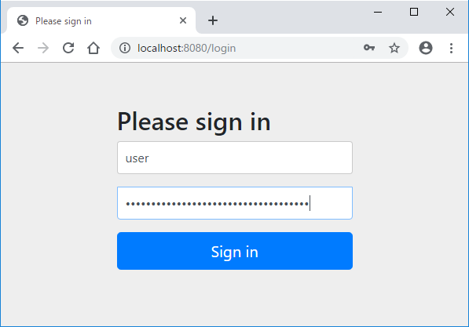

include::_include_all.adoc[]

:sectnums: 4
:toclevels: 6

[[Spring_Security]]
= {SSE}

[[Spring_Security_Overview]]
== {overview}
{SSE}は、アプリケーションにセキュリティ対策機能を実装する際に使用するフレームワークである。 +
主に下記の機能を提供している。

* アプリケーションのセキュリティを担う認証、認可機能
* Webアプリケーションのセキュリティ対策強化機能

{GL}では一般的なWebアプリケーションでの利用頻度が高いと思われる機能に絞って説明する。 +
説明していない機能については {ss_reference_url}[{SSE} Reference]を参照すること。 +

``{SBS}-security``をpom.xmlの依存関係に追加すると{sb}の{AC}によりセキュリティ機能が有効になる。 +
``WebSecurityConfigurerAdapter``を拡張することでJavaConfigによるセキュリティ機能の設定が可能になる。 +
{AC}によるデフォルト設定では下記の機能が有効になる。

[cols="20,80a",options="header"]
.{AC}で有効になる主な機能
|===
|グループ
|有効になる機能

|認証・認可
|
* 全リクエストへの認証要求
* 認証・認可のエラーハンドリング
* ログイン/ログアウト画面
* Basic認証

|セキュリティ対策強化
|
* CSRF対策
* セッション固定化攻撃対策
* レスポンスへのセキュリティヘッダ追加
|===

[[Spring_Security_HowToUse]]
== {how_to_use}
=== {starter_to_use}
{sb}で{SSE}を有効にするには``{SBS}-security``を依存関係に追加する。 +
詳細はlink:https://spring.io/guides/gs/securing-web/#initial[Set up Spring Security]を参照すること。

=== {enable_auto_configuration}
[[Spring_Security_Enable_AutoConfiguration_Table]]
``{SBS}-security``を依存関係に追加した場合に、有効になる代表的な{AC}を下記に示す。

[cols="30,70", options="header"]
.代表的な{enable_auto_configuration}
|===
|クラス名
|概要

|``org.springframework.boot.autoconfigure.`` +
``security.servlet.SecurityAutoConfiguration``
|AuthenticationEventPublisherのオブジェクトを生成しBean定義を行う。

|``org.springframework.boot.autoconfigure.`` +
``security.servlet.SpringBootWebSecurityConfiguration``
|WebSecurityConfigurerAdapterのオブジェクトを生成しBean定義を行う。

|``org.springframework.boot.autoconfigure.`` +
``security.servlet.WebSecurityEnablerConfiguration``
|``@EnableWebSecurity``でセキュリティ機能を有効にする。

|``org.springframework.security.config.`` +
``annotation.authentication.configuration.AuthenticationConfiguration``
|認証処理に使用するコンフィグクラスオブジェクトを生成しBean定義を行う。

|``org.springframework.boot.autoconfigure.`` +
``security.servlet.UserDetailsServiceAutoConfiguration``
|UserDetailsServiceのオブジェクトを生成しBean定義を行う。

|``org.springframework.boot.autoconfigure.`` +
``security.servlet.SecurityFilterAutoConfiguration``
|DelegatingFilterProxyRegistrationBeanのオブジェクトを生成しBean定義を行う。

|``org.springframework.boot.autoconfigure.`` +
``security.servlet.SecurityRequestMatcherProviderAutoConfiguration``
|RequestMatcherProviderのオブジェクトを生成しBean定義を行う。

|===

=== {customization_points}
==== {property_based_configuration}
詳細は {reference_url}#common-application-properties[{SSE} Reference common-application-properties]の「SECURITY PROPERTIES」を参照すること。

==== {bean_based_configuration}
{SSE} 3.2以降では、``WebSecurityConfigurerAdapter``を継承したクラスの各種configureメソッドをオーバーライドすることで{SSE}の設定が可能となっている。 +
各種configureの一覧と説明は<<Spring_Security_HowToUse_Basic_Implementation_config,WebSecurityConfigurerAdapter>>で行う。

[[Spring_Security_HowToUse_Basic_Implementation]]
=== {functional_how_to_use}
pom.xmlの依存関係に``{SBS}-security``を追加してセキュリティ機能を有効にすると、``/login``にデフォルトのログインフォームが表示されるようになる。 +
デフォルト設定の場合、ユーザ名："user"とアプリケーション起動時にコンソールに表示されるパスワードでログインができる。

.コンソールに表示されるパスワード
----
Using generated security password: b5ab4c9d-0fcf-4733-b9d0-64fb17991189
----

.デフォルトのログイン画面

各プロジェクトに合わせて{SSE}の設定を変更するには、``WebSecurityConfigurerAdapter``を継承したクラスのconfigureメソッドをオーバーライドする必要がある。 +
{GL}では基本的な使い方としてログイン画面の実装例を紹介する。

[[Spring_Security_HowToUse_Basic_Implementation_Login]]

[cols="10,90",options="header"]
.ログイン画面の仕様
|===
|項番
|仕様

|(1)
|フォーム認証。URLは「/login」である。

|(2)
|「/admin」配下のURLには認証チェックを行う。

|(3)
|Viewは{TH}で実装する。

|===

* {SSE} Java Config

[source,java]
.CustomSecurityConfig.java
----
@EnableWebSecurity
public class CustomSecurityConfig extends WebSecurityConfigurerAdapter {

    @Autowired
    private AuthenticationSuccessHandler successHandler;
    @Autowired
    private AuthenticationFailureHandler failureHandler;

    @Override
    protected void configure(HttpSecurity http) throws Exception {
        http.authorizeRequests()
            .mvcMatchers("/admin/**").authenticated() //(1)
            .anyRequest().permitAll()
            .and()
            .formLogin() //(2)
            .loginPage("/login")
            .successHandler(successHandler) //(3)
            .failureHandler(failureHandler); //(4)
    }
}
----

[cols="10,90",options="header"]
|===
|項番
|概要

|(1)
|admin配下のURLに認証を要求する。それ以外は認証不要である。

|(2)
|フォーム認証を使用する。

|(3)
|認証成功時のハンドラクラスオブジェクトを指定する

|(4)
|認証失敗時のハンドラクラスオブジェクトを指定する
|===

* ログイン画面のControllerクラス

[source,java]
.LoginController.java
----
@Controller
@RequestMapping("login")
public class LoginController {

    @GetMapping // (1)
    public ModelAndView initView(ModelAndView model) {
        model.setViewName("login");
        return model;
    }

    @PostMapping("error") // (2)
    public ModelAndView fail(ModelAndView model, String username) {
        model.addObject("username", username);
        model.addObject("errMessage", "Login failed. Please check username and password.");
        model.setViewName("login");
        return model;
    }
}
----

[cols="10,90",options="header"]
|===
|項番
|概要

|(1)
|初期表示。

|(2)
|ログイン失敗(ユーザ名またはパスワード誤り)の場合に遷移する。
|===

* 認証成功時のハンドラクラス

[source,java]
.CustomAuthSuccessHandler.java
----
@Component
public class CustomAuthSuccessHandler extends SavedRequestAwareAuthenticationSuccessHandler { // (1)

    public CustomAuthSuccessHandler() {
        super();
        setDefaultTargetUrl("/"); // (2)
    }

    // (3)
    @Override
    public void onAuthenticationSuccess(HttpServletRequest request,
        HttpServletResponse response, Authentication authentication)
        throws ServletException, IOException {
        super.onAuthenticationSuccess(request, response, authentication);
    }
}

----

[cols="10,90",options="header"]
|===
|項番
|概要

|(1)
|デフォルトで使用されるAuthenticationSuccessHandlerを継承する。 +
SavedRequestAwareAuthenticationSuccessHandlerは認証前にアクセスを試みたURLにリダイレクトを行う。

|(2)
|ログイン成功時に、認証前にアクセスを試みたURLが無かった場合のリダイレクト先を指定する。

|(3)
|認証成功時に、共通処理がある場合は``onAuthenticationSuccess``メソッド内に記載する。
|===

* 認証失敗時のハンドラクラス

[source,java]
.CustomAuthFailureHandler.java
----
@Component
public class CustomAuthFailureHandler extends SimpleUrlAuthenticationFailureHandler { // (1)

    public CustomAuthFailureHandler() {
        super();
    }

    // (2)
    @Override
    public void onAuthenticationFailure(HttpServletRequest request, HttpServletResponse response,
            AuthenticationException exception) throws IOException, ServletException {
        saveException(request, exception);
        request.getRequestDispatcher("/login/error").forward(request, response);
    }
}

----

[cols="10,90",options="header"]
|===
|項番
|概要

|(1)
|デフォルトで使用されるAuthenticationFailureHandlerを継承する。 +
SimpleUrlAuthenticationFailureHandlerは指定したパス(defaultTargetUrl)にリダイレクト又はフォワードを行う。

|(2)
|認証失敗時に、共通処理がある場合は``onAuthenticationFailure``メソッド内に記載する。

|===

* ログイン画面

[source,html]
.login.html
----
<!DOCTYPE html>
<html xmlns:th="http://www.thymeleaf.org">
    <head>
        <meta charset="utf-8">
        <meta name="author" content="">
        <title>Login</title>
    </head>
    <body>
        <!-- (1) -->
        <form method="post" th:action="@{/login}">
            <h2>Please sign in</h2>
            
[[${errMessage}]]

            

                <label for="username">Username</label>
                <input type="text" id="username" name="username" autofocus th:value="${username}">
            

            

                <label for="password">Password</label>
                <input type="password" id="password" name="password">
            

            <button type="submit">Sign in</button>
        </form>
    </body>
</html>
----

[cols="10,90",options="header"]
|===
|項番
|概要

|(1)
|「th:action」で記載することでcsrfトークンのinputタグがhtml生成時に自動で追加される。
|===

[[Spring_Security_HowToUse_Basic_Implementation_config]]
==== WebSecurityConfigurerAdapter
``WebSecurityConfigurerAdapter``には3つのconfigureメソッドが用意されている。 +
本節では、各configureのプロパティと実装例を説明する。

[cols="20,30,50",options="header"]
|===
|種類
|メソッド
|概要

|<<Spring_Security_HowToUse_Basic_Implementation_config_httpsecurity,HTTP要求へのセキュリティ設定>>
|configure(HttpSecurity)
|namespaceの<html>タグに対応した設定ができる。

|<<Spring_Security_HowToUse_Basic_Implementation_config_websecurity,springSecurityFilterChainを作成するクラスの設定>>
|configure(WebSecurity)
|認証を無視するRequestMatcherの指定などができる。 +
デフォルトでは何も行わない。

|<<Spring_Security_HowToUse_Basic_Implementation_config_authenticationmanager,認証方法の設定>>
|configure(AuthenticationManagerBuilder)
|作成したUserDetailsServiceやPasswordEncoderの指定ができる。 +
UserDetailsServiceでの認証以外にも、メモリ認証、JDBC認証、LDAP認証が用意されている。

|===

[[Spring_Security_HowToUse_Basic_Implementation_config_httpsecurity]]
HTTP要求へのセキュリティ設定::

[cols="20,35,45", options="header"]
.configure(HttpSecurity)のプロパティ一覧
|===
|プロパティ
|デフォルト値
|概要

|authorizeRequests
|すべてのURLに認証を要求する。 +
(メソッドをオーバーライドした場合は無効)
|URL単位で要求する認証・認可の設定を行う。

|formLogin
|ログイン画面：(GET) /login +
ログイン処理：(POST) /login +
成功時のリダイレクトURL：/ +
失敗時のリダイレクトURL：/login?error
|フォーム認証の設定を行う。 +
ログイン処理のURL、ログイン成功/失敗のハンドリングを指定できる。

|logout
|ログアウト画面：(GET) /logout +
ログアウト処理：(POST) /logout +
ログアウト後のリダイレクトURL：/login?logout
|ログアウト処理の設定を行う。 +
ログアウト用のURL、ログアウト時に削除するCookieの名前を指定できる。 +

|rememberMe
|無効。 +
有効にする場合はUserDetailsServiceも指定する必要がある。
|Remember-Me認証の設定を行う。 +
Remember-Me認証用Cookieの有効期間や名前を指定できる。

|exceptionHandling
|認可失敗などで例外が発生した場合に403エラーのレスポンスを返却する。
|例外処理の設定を行う。 +
実装者は認可失敗時のハンドリングを指定する。 +

|csrf
|GET, HEAD, TRACE, OPTIONS以外のHTTPメソッドでのリクエストにトークンチェックを行う。
|Cross-site Request Forgery対策の設定を行う。 +
トークンチェックをしないURLパターンなどを指定できる。

|sessionManagement
|有効。 +
ログイン成功時にセッションIDを振り直す。
|セッション関連の設定を行う。 +
セッションタイムアウト時のリダイレクトURLやセッションIDの制御方法を指定できる。

|headers
|レスポンスに下記のヘッダが設定される。 +
Cache-Control: no-cache, no-store, max-age=0, must-revalidate +
Pragma: no-cache +
Expires: 0 +
X-Content-Type-Options: nosniff +
Strict-Transport-Security: max-age=31536000 ; includeSubDomains(httpsの場合) +
X-Frame-Options: DENY +
X-XSS-Protection: 1; mode=block
|レスポンスに追加するセキュリティヘッダの設定を行う。 +

|cors
|別オリジンからのアクセスは拒否される。
|アクセスを許可する別オリジンの設定を行う。 +
許可する別オリジンおよびHTTPメソッドとアプリケーション側のURLをマッピングして指定する。

|===

[source,java]
.configure(HttpSecurity)の実装例
----
@Override
protected void configure(HttpSecurity http) throws Exception {
    http.authorizeRequests().antMatchers("/admin").authenticated()
        .anyRequest().permitAll()
        .and()
        .formLogin().loginPage("/signin").loginProcessingUrl("/signin")
        .usernameParameter("ID").passwordParameter("pass")
        .successHandler(successHandler).failureHandler(failureHandler)
        .and()
        .logout().logoutUrl("/logoff").logoutSuccessUrl("/signin")
        .and()
        .exceptionHandling().accessDeniedHandler(deniedHandler)
        .and()
        .rememberMe().userDetailsService(userDetailsService)
        .and()
        .cors().configurationSource(corsConfigurationSource());
}

----

[[Spring_Security_HowToUse_Basic_Implementation_config_websecurity]]
springSecurityFilterChainを作成するクラスの設定::

[cols="20,20,60", options="header"]
.configure(WebSecurity)のプロパティ一覧
|===
|プロパティ
|デフォルト値
|概要

|ignoring
|(未指定)
|``/resource/static``配下の静的リソースについて、セキュリティ対策を適用しないパスの指定を行う。

|httpFirewall
|StrictHttpFirewall
|FilterChainProxyで使用するHttpFirewallの指定を行う。

|debug
|false
|{SSE}のデバッグサポートを制御する。

|privilegeEvaluator
|DefaultWebInvocationPrivilegeEvaluator
|リクエストURIに対する認可判定方法の指定を行う。

|expressionHandler
|DefaultWebSecurityExpressionHandler
|認証・認可の判定式(Spring EL式)の実装を指定する。

|===

[source,java]
.configure(WebSecurity)の実装例
----
@Override
public void configure(WebSecurity web) {
    web.ignoring().mvcMatchers("/css/**", "/js/**", "/images/**", "/**/favicon.ico");
}

----

[[Spring_Security_HowToUse_Basic_Implementation_config_authenticationmanager]]
認証方法の設定::

[cols="20,20,60", options="header"]
.configure(AuthenticationManagerBuilder)のプロパティ一覧
|===
|プロパティ
|デフォルト値
|概要

|userDetailsService
|InMemoryUserDetailsManager
|資格情報(UserDetails)の取得方法を指定する。

|passwordEncoder
|DelegatingPasswordEncoder
|パスワードのエンコード・照合方法を指定する。

|authenticationProvider
|DaoAuthenticationProvider
|認証処理の方式を指定する。 +
デフォルトでは、UserDetailsServiceからUserDetailsを取得して認証オブジェクト(Authentication)を作成する。 +

|===

[source,java]
.configure(AuthenticationManagerBuilder)の実装例
----
@Override
protected void configure(AuthenticationManagerBuilder auth) throws Exception {
    auth.userDetailsService(userDetailsService).passwordEncoder(passwordEncoder);
}

----

==== メソッドセキュリティ
メソッドセキュリティは、アノテーションをメソッドにつけることでサービスレイヤのメソッドにアクセス制御をする仕組みである。 +
ただし、``{SBS}-security``を依存関係へ追加したのみでは有効にならない。 +
有効にする場合は``@EnableGlobalMethodSecurity``を``@Configuration``のクラスに注釈し、有効にするチェックに``true``を指定する必要がある。

[cols="20,20,60", options="header"]
.@EnableGlobalMethodSecurityのチェック一覧
|===
|属性
|デフォルト値
|概要

|prePostEnabled
|false
|メソッド実行前後のチェック(``@PreAuthorize``など)の有効・無効を指定する。

|securedEnabled
|false
|メソッドの権限チェック(``@Secured``)の有効・無効を指定する。

|jsr250Enabled
|false
|JSR-250 (``javax.annotation.security``パッケージ)のアノテーション(``@RolesAllowed``など)の有効・無効を指定する。

|===

[source,java]
.@EnableGlobalMethodSecurityの設定例
----
@EnableGlobalMethodSecurity(securedEnabled=true, prePostEnabled=true)
----

[source,java]
.メソッドセキュリティの実装例
----
@PreAuthorize("hasAuthority('ADMIN')") // (1)
public boolean update(String memberId) {
    // omitted
}
----

[cols="10,90",options="header"]
|===
|項番
|概要

|(1)
|権限「ADMIN」を持ったユーザでない場合認可エラーになる。
|===

[[Spring_Security_Test]]
== {test}

[[Spring_Security_Test_Starter]]
=== {test_starter_to_use}
{SSE}の認証情報をテストで使用するためには``spring-security-test``を依存関係に追加する必要がある。 +
{SI}でSecurityを選択した場合は自動で追加される。

=== {test_function}
下記のアノテーションを使用することで、テスト実行時に使用する認証情報をSecurityContextに設定できる。 +
``@SpringBootTest``をテストクラスに注釈することで使用可能になる。 +
``@WebMvcTest``を使用してテストをする場合は、``@Import``や``@ComponentScan``で別途必要なBeanを生成する必要がある。 +
(UserDetailsServiceやAuthenticationSuccessHandlerなどはスキャン対象外のため)

[cols="20,35,45", options="header"]
.アノテーション一覧
|===
|アノテーション
|概要
|参照

|``@WithMockUser``
|疑似ユーザ。名前、パスワード、ロール、権限をカスタムできる。
|link:{ss_reference_url}#test-method-withmockuser[test-method-withmockuser]

|``@WithAnonymousUser``
|匿名ユーザ。
|link:{ss_reference_url}#test-method-withanonymoususer[test-method-withanonymoususer]

|``@WithUserDetails``
|ユーザ名を指定する。 +
UserDetailsServiceで資格情報を取得できるユーザ名にする必要がある。
|link:{ss_reference_url}#test-method-withuserdetails[test-method-withuserdetails]

|===

下記クラスのstaticメソッドを使用することでセキュリティに関するテストをMockMvcで行うことができる。

[cols="40,60", options="header"]
.{SSE}のMockMvc向けクラス一覧
|===
|クラス
|概要

|``org.springframework.security.test.web.servlet.setup.SecurityMockMvcConfigurers``
|MockMvcに{SSE}に必要な設定を行うクラス。 +
springSecurityFilterChainとSecurityContextを追加する。

|``org.springframework.security.test.web.servlet.request.SecurityMockMvcRequestPostProcessors``
|MockMvcでリクエストに認証情報を設定するファクトリメソッドの集合クラス。

|``org.springframework.security.test.web.servlet.request.SecurityMockMvcRequestBuilders``
|MockMvcでフォーム認証によるログインおよび、ログアウトを行うためのクラス。

|``org.springframework.security.test.web.servlet.response.SecurityMockMvcResultMatchers``
|MockMvcレスポンスが認証済みかを判定するためのクラス。

|===

[[Spring_Security_Test_Implementatioin]]
=== {test_how_to_use}
本節では、これまでに紹介した{SSE}のテスト機能について使い方を説明する。

==== 認証のテスト
<<Spring_Security_HowToUse_Basic_Implementation,{functional_how_to_use}>>で実装したログイン画面に対してテストを行う場合の例を説明する。 +
フォーム認証を行い、ログイン後に遷移するURLがCustomAuthSuccessHandlerクラスで指定したものになっていることを確認する。 +
本テスト例ではパスワードを固定にするため、下記の``UserDetailsService``実装クラスを使用する。

[source,java]
.CustomUserDetailsService.java
----
public class CustomUserDetailsService implements UserDetailsService {

    private PasswordEncoder encoder = PasswordEncoderFactories.createDelegatingPasswordEncoder();

    @Override
    public UserDetails loadUserByUsername(String username) throws UsernameNotFoundException {
        if (username == null) throw new UsernameNotFoundException("Login failed.");
        User user = new User(username, encoder.encode("password"), Collections.emptyList()); // (1)
        return user;
    }
}
----
[cols="10,90",options="header"]
|===
|項番
|概要

|(1)
|本テスト例では、固定のパスワードでUserオブジェクトを生成するスタブメソッドとして実装している。

|===

[source,java]
.LoginTest.java
----
@WebMvcTest
@Import({CustomUserDetailsService.class,  CustomAuthSuccessHandler.class, CustomAuthFailureHandler.class}) //(1)
public class LoginTest {

    @Autowired
    private MockMvc mvc;

    @Test
    void test() throws Exception {
        mvc.perform(formLogin().loginProcessingUrl("/login") //(2)
            .user("name").password("password"))
            .andExpect(status().is3xxRedirection())
            .andExpect(redirectedUrl("/"))
            .andExpect(authenticated()); //(3)
    }
}
----

[cols="10,90",options="header"]
|===
|項番
|概要

|(1)
|``@WebMvcTest``でスキャンされないクラスを@Importで指定する。

|(2)
|``SecurityMockMvcRequestBuilders#formLogin()``を使用してログイン処理へのリクエストを構成する。

|(3)
|``SecurityMockMvcResultMatchers#authenticated()``で認証済みであることを確認する。

|===

==== 認可のテスト
``@WithMockUser``を使用して認可テストを行う場合の例を説明する。 +
Configure指定したとおりに認可が動作することを確認する。

[source,java]
.WebSecurityConfig.java
----
@EnableWebSecurity
public class WebSecurityConfig extends WebSecurityConfigurerAdapter {

    @Override
    protected void configure(HttpSecurity http) throws Exception {
        http.authorizeRequests()
            // (1)
            .mvcMatchers(HttpMethod.GET, "/method").permitAll()
            .mvcMatchers(HttpMethod.POST, "method").authenticated()
            .mvcMatchers(HttpMethod.PUT, "/method").hasAuthority("manager")
            .mvcMatchers(HttpMethod.DELETE, "/method").hasAuthority("admin")
            .mvcMatchers(HttpMethod.PATCH, "/method").hasAuthority("admin")
            .anyRequest().permitAll();

    }
}

----
[cols="10,90",options="header"]
|===
|項番
|概要

|(1)
|HTTPメソッド別に認証・認可を設定する。

|===

[source,java]
.RoleTest.java
----
@WebMvcTest
public class RoleTest {

    @Autowired
    private MockMvc mvc;

    @Test
    @WithMockUser(authorities="manager")
    void test() throws Exception {
        mvc.perform(get("/method")).andExpect(status().isOk());
        // (1)
        mvc.perform(post("/method").with(csrf())).andExpect(status().isOk());
        mvc.perform(put("/method").with(csrf())).andExpect(status().isOk());
        mvc.perform(delete("/method").with(csrf())).andExpect(status().isForbidden());
        mvc.perform(patch("/method").with(csrf())).andExpect(status().isForbidden());
    }
}
----
[cols="10,90",options="header"]
|===
|項番
|概要

|(1)
|GET, HEAD, TRACE, OPTIONS以外のHTTPメソッドの場合、SecurityMockMvcRequestPostProcessors.csrf()でCSRFトークンを追加する。 +
(CSRF対策の機能が{sb}のAutoConfigurationで有効になっているため)

|===
